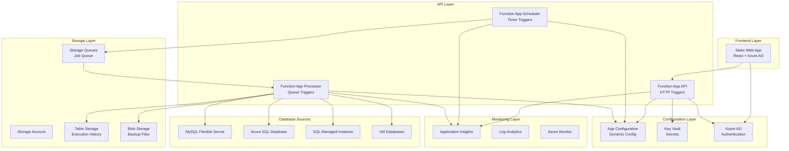
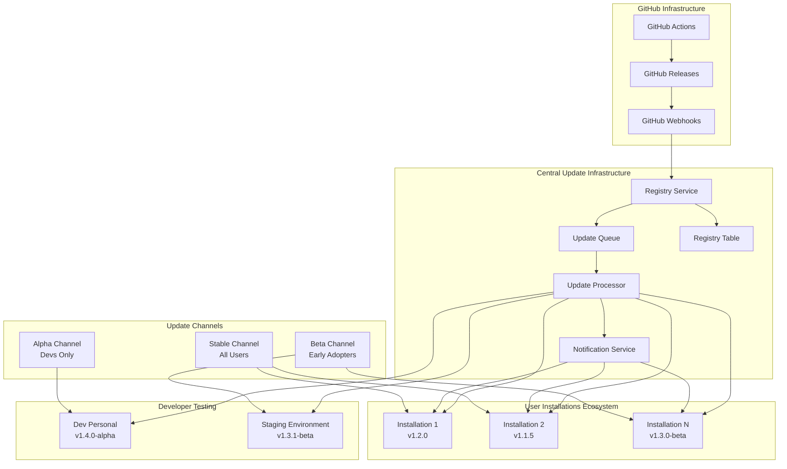

# Dilux Azure Databases Backup Solution

## 🚀 One-Click Enterprise Database Backup Solution

Una solución completa y serverless para backup automático de múltiples bases de datos en Azure con interfaz web de administración y autenticación Azure AD.

## 📋 Índice

- [Características](#-características)
- [Arquitectura](#-arquitectura)
- [Sistema de Auto-Update](#-sistema-de-auto-update)
- [Deployment One-Click](#-deployment-one-click)
- [Canales de Update y Testing](#-canales-de-update-y-testing)
- [CI/CD y Release Management](#-cicd-y-release-management)
- [Registry de Instalaciones](#-registry-de-instalaciones)
- [Bases de Datos Soportadas](#-bases-de-datos-soportadas)
- [Componentes de la Solución](#-componentes-de-la-solución)
- [Configuración Técnica](#-configuración-técnica)
- [API Reference](#-api-reference)
- [Administración Web](#-administración-web)
- [Seguridad](#-seguridad)
- [Monitoreo y Logs](#-monitoreo-y-logs)
- [Costos](#-costos)
- [Troubleshooting](#-troubleshooting)

## 🎯 Características

### ✅ **Funcionalidades Core**
- **Backup automático** con frecuencias configurables (15m, 1h, 6h, 1d, 1w)
- **Múltiples tipos de bases de datos** (MySQL, SQL Server, Azure SQL DB, PostgreSQL)
- **Configuración dinámica** sin redeploy via Azure App Configuration
- **Web dashboard** con autenticación Azure AD
- **API RESTful** para integración con otros sistemas
- **Backup manual** on-demand via web o API
- **Historial completo** de backups con audit trail
- **Reintentos automáticos** en caso de fallos
- **Formatos optimizados** (.sql.gz, .bacpac, .bak)
- **Gestión segura de passwords** via Azure Key Vault
- **Descarga de backups** con autenticación
- **Destinos personalizables** por base de datos

### ✅ **Enterprise Features**
- **Multi-tenant** support via Azure AD
- **RBAC** (Role-Based Access Control)
- **Audit logs** completos con trail de accesos
- **Alertas** via email/Teams/Slack
- **Backup validation** automática por formato
- **Retention policies** configurables
- **Encryption** en tránsito y reposo
- **Password management** con rotación automática
- **Disaster recovery** ready
- **Auto-update system** con canales alpha/beta/stable
- **Central registry** para gestión de instalaciones
- **Zero-downtime updates** con rollback automático
- **Backup listing/filtering** por fecha y base de datos

## 🏗 Arquitectura

### **Diagrama de Arquitectura**



### **Flujo de Datos**

```
1. Scheduler Function App (cada 15 min) → Lee App Configuration
2. Por cada DB habilitada → Verifica si debe hacer backup
3. Si es hora → Envía mensaje a Storage Queue con formato específico
4. Processor Function App → Procesa backup individual desde queue
5. Ejecuta comando específico por tipo (mysqldump/.bacpac/.bak)
6. Comprime según formato → Sube a Blob Storage
7. Actualiza audit trail → Logs → Notificaciones
8. API Function App → Sirve dashboard, gestiona passwords y descarga backups
```

### **Arquitectura Multi-Function App**

**Separación de responsabilidades en 3 Function Apps para escalabilidad y mantenimiento:**

```
📱 Function App 1: API (dadb-xyz-api)
├── GetDatabases (HTTP) - Listar bases configuradas
├── CreateDatabase (HTTP) - Agregar nueva configuración
├── UpdateDatabase (HTTP) - Modificar configuración
├── DeleteDatabase (HTTP) - Eliminar configuración
├── UpdateDatabasePassword (HTTP) - Gestión segura de passwords
├── TriggerManualBackup (HTTP) - Backup on-demand
├── GetBackupHistory (HTTP) - Historial y audit trail
├── ListBackups (HTTP) - Listar archivos disponibles
└── DownloadBackup (HTTP) - Descarga autenticada

⏰ Function App 2: Scheduler (dadb-xyz-scheduler)  
├── DynamicScheduler (Timer: cada 15 min) - Evalúa programaciones
├── AutoUpdateRegistration (Timer: diario) - Sistema de updates
└── PasswordRotationCheck (Timer: semanal) - Validar passwords

🔄 Function App 3: Processor (dadb-xyz-processor)
├── BackupProcessor (Queue trigger) - Ejecuta backups reales
├── HealthMonitor (Timer: cada 6 horas) - Monitoreo de salud
└── CleanupOldBackups (Timer: diario) - Políticas de retención
```

**Ventajas de esta arquitectura:**
- ✅ **Escalabilidad independiente** - Cada Function App escala según demanda
- ✅ **Separation of concerns** - API, scheduling y processing separados
- ✅ **Fault isolation** - Fallo en uno no afecta otros
- ✅ **Flex Consumption** - Facturación optimizada por uso real
- ✅ **Development velocity** - Teams pueden trabajar en paralelo

### **Nomenclatura de Recursos**

```json
{
  "naming_convention": "dadb-{randomString}-{resourceType}",
  "random_string": {
    "length": 8,
    "format": "[a-z0-9]",
    "example": "x7k9m3p2"
  },
  "resources": {
    "resource_group": "rg-dadb-x7k9m3p2",
    "storage_account": "dadbx7k9m3p2storage",
    "function_app_api": "dadb-x7k9m3p2-api", 
    "function_app_scheduler": "dadb-x7k9m3p2-scheduler",
    "function_app_processor": "dadb-x7k9m3p2-processor",
    "static_web_app": "dadb-x7k9m3p2-web",
    "app_configuration": "dadb-x7k9m3p2-config", 
    "key_vault": "dadb-x7k9m3p2-kv",
    "application_insights": "dadb-x7k9m3p2-insights"
  }
}
```

## 🔄 Sistema de Auto-Update

### **Arquitectura del Auto-Update System**



### **Flujo Completo de Auto-Update**

```
1. Developer: git tag v1.3.0 && git push origin v1.3.0
2. GitHub Actions: Build packages + Create Release
3. GitHub: Send webhook to Registry Service
4. Registry Service: Query active installations by channel
5. Registry Service: Enqueue update jobs for each installation
6. Update Processor: Execute ARM deployments on user subscriptions
7. Notification Service: Notify users of update completion
8. Installation: Self-register with new version
```

### **Canales de Update**

| Canal | Audiencia | Auto-Update | Frecuencia | Tags |
|-------|-----------|-------------|------------|------|
| **Alpha** | Solo developers | Manual | Bajo demanda | `v1.3.0-alpha.1` |
| **Beta** | Early adopters | Automático | Semanal | `v1.3.0-beta.1` |
| **Stable** | Todos los usuarios | Automático | Monthly | `v1.3.0` |

## 🎬 Deployment One-Click

### **Deploy to Azure Button**

[](https://portal.azure.com/#create/Microsoft.Template/uri/https%3A%2F%2Fraw.githubusercontent.com%2Fdilux-solutions%2Fazure-database-backup%2Fmain%2Fdeploy%2Fazuredeploy.json)

### **ARM Template Structure**

```
deploy/
├── azuredeploy.json           # Main ARM template
├── azuredeploy.parameters.json # Parameters file
├── nested/
│   ├── storage.json          # Storage Account
│   ├── functions.json        # Function App
│   ├── appconfig.json        # App Configuration
│   ├── staticweb.json        # Static Web App
│   ├── keyvault.json         # Key Vault
│   └── monitoring.json       # Application Insights
├── scripts/
│   ├── setup-aad.ps1         # Azure AD App Registration
│   ├── configure-permissions.ps1 # RBAC Setup
│   └── initialize-config.ps1  # Initial configuration
└── docs/
    └── deployment-guide.md    # Step-by-step guide
```

### **Pre-deployment Requirements**

```json
{
  "userPermissions": [
    "Application.ReadWrite.All",
    "Directory.ReadWrite.All", 
    "AppRoleAssignment.ReadWrite.All"
  ],
  "azureRoles": [
    "Contributor",
    "User Access Administrator"
  ]
}
```

### **Deployment Parameters**

```json
{
  "$schema": "https://schema.management.azure.com/schemas/2019-04-01/deploymentParameters.json#",
  "contentVersion": "1.0.0.0",
  "parameters": {
    "solutionName": {
      "value": "dilux-db-backup"
    },
    "adminUserPrincipalName": {
      "value": "admin@contoso.com"
    },
    "location": {
      "value": "East US 2"
    },
    "pricingTier": {
      "value": "Production"
    },
    "enableMonitoring": {
      "value": true
    },
    "backupRetentionDays": {
      "value": 30
    }
  }
}
```

### **Post-Deployment Configuration Script**

```powershell
# scripts/setup-aad.ps1
param(
    [Parameter(Mandatory=$true)]
    [string]$AdminEmail,
    
    [Parameter(Mandatory=$true)]
    [string]$ResourceGroupName,
    
    [Parameter(Mandatory=$true)]
    [string]$StaticWebAppName
)

# 1. Create Azure AD App Registration
$app = az ad app create --display-name "Dilux DB Backup" --query appId -o tsv

# 2. Configure redirect URIs
$webAppUrl = az staticwebapp show --name $StaticWebAppName --resource-group $ResourceGroupName --query defaultHostname -o tsv
az ad app update --id $app --web-redirect-uris "https://$webAppUrl/.auth/login/aad/callback"

# 3. Create Service Principal
az ad sp create --id $app

# 4. Assign admin user
az role assignment create --assignee $AdminEmail --role "Dilux DB Backup Admin" --scope "/subscriptions/$(az account show --query id -o tsv)/resourceGroups/$ResourceGroupName"

# 5. Configure Function App authentication
az functionapp auth update --name "dilux-db-backup-func" --resource-group $ResourceGroupName --enabled true --action LoginWithAzureActiveDirectory --aad-client-id $app

Write-Host "Setup completed. Admin app ID: $app"
```

## 🧪 Canales de Update y Testing

### **Alpha Channel - Developer Testing**

#### **Configuración Alpha**
```bash
# Tags para testing personal
git tag v1.3.0-alpha.1    # Primera iteración
git tag v1.3.0-alpha.2    # Correcciones
git tag v1.3.0-alpha.3    # Release candidate

# Solo se despliega a tu instalación personal
# No afecta usuarios finales
```

#### **Deployment Personal Setup**
```yaml
# .github/workflows/dev-deployment.yml
name: Developer Personal Deployment

on:
  push:
    branches: [develop, feature/*]
    tags: ['v*-alpha*']

jobs:
  deploy-to-personal-dev:
    runs-on: ubuntu-latest
    environment: dev-personal
    
    steps:
      - uses: actions/checkout@v4
      
      - name: Deploy to Personal Function App
        uses: Azure/functions-action@v1
        with:
          app-name: dilux-backup-dev-{your-name}
          package: src/backend
          publish-profile: ${{ secrets.DEV_AZURE_PUBLISH_PROFILE }}
          
      - name: Update Dev Environment Settings
        run: |
          az functionapp config appsettings set \
            --name dilux-backup-dev-{your-name} \
            --resource-group rg-dev-{your-name} \
            --settings "APP_VERSION=${GITHUB_REF#refs/tags/}" \
                      "ENVIRONMENT=development" \
                      "AUTO_UPDATE_ENABLED=false" \
                      "UPDATE_CHANNEL=alpha"
                      
      - name: Run Integration Tests
        run: |
          cd tests/integration
          python -m pytest --env=dev --verbose
```

### **Beta Channel - Early Adopters**

#### **Beta Configuration**
```json
{
  "beta_channel": {
    "auto_update": true,
    "max_concurrent_updates": 5,
    "rollback_on_failure": true,
    "notification_required": true,
    "testing_period_hours": 24
  }
}
```

#### **Beta User Management**
```python
# registry_service.py - Beta user handling
class BetaChannelManager:
    def __init__(self):
        self.table_service = TableServiceClient.from_connection_string(
            os.environ['REGISTRY_STORAGE_CONNECTION']
        )
        
    def enroll_beta_user(self, installation_id: str, admin_email: str):
        """Enroll installation in beta channel"""
        
        table_client = self.table_service.get_table_client('InstallationRegistry')
        
        # Update installation record
        entity = table_client.get_entity('installation', installation_id)
        entity['UpdateChannel'] = 'beta'
        entity['BetaEnrollmentDate'] = datetime.utcnow()
        entity['AdminConfirmation'] = True
        
        table_client.update_entity(entity)
        
        # Send welcome email
        self.send_beta_welcome_email(admin_email)
        
    def send_beta_welcome_email(self, admin_email: str):
        """Send beta program welcome email"""
        
        email_content = """
        🚀 Welcome to Dilux Database Backup Beta Program!
        
        You're now enrolled to receive early access to new features.
        
        What to expect:
        - New versions 1-2 weeks before stable release
        - Automatic updates (with 24h rollback window)
        - Direct feedback channel to development team
        
        You can opt-out anytime from your dashboard.
        
        Happy testing!
        The Dilux Team
        """
        
        send_email(admin_email, "Beta Program Enrollment", email_content)
```

### **Stable Channel - Production Users**

#### **Stable Release Criteria**
```python
# release_validation.py
class ReleaseValidator:
    def __init__(self):
        self.beta_testing_period = timedelta(days=7)
        self.min_beta_installations = 10
        
    def validate_stable_release(self, version: str) -> bool:
        """Validate if version is ready for stable release"""
        
        # 1. Check beta testing period
        beta_release_date = self.get_beta_release_date(version)
        if datetime.utcnow() - beta_release_date < self.beta_testing_period:
            return False
            
        # 2. Check beta success rate
        beta_stats = self.get_beta_stats(version)
        if beta_stats['success_rate'] < 0.95:  # 95% success rate required
            return False
            
        # 3. Check critical issues
        if self.has_critical_issues(version):
            return False
            
        # 4. Check minimum beta installations
        if beta_stats['installation_count'] < self.min_beta_installations:
            return False
            
        return True
        
    def get_beta_stats(self, version: str) -> dict:
        """Get beta installation statistics"""
        
        table_client = self.table_service.get_table_client('UpdateHistory')
        
        filter_query = f"PartitionKey eq 'update' and TargetVersion eq '{version}' and Channel eq 'beta'"
        updates = list(table_client.query_entities(filter=filter_query))
        
        total = len(updates)
        successful = len([u for u in updates if u['Status'] == 'completed'])
        
        return {
            'installation_count': total,
            'success_rate': successful / total if total > 0 else 0,
            'total_updates': total,
            'successful_updates': successful,
            'failed_updates': total - successful
        }
```

## 🚀 CI/CD y Release Management

### **GitHub Actions Pipeline Completo**

#### **1. Continuous Integration**
```yaml
# .github/workflows/ci.yml
name: Continuous Integration

on:
  push:
    branches: [main, develop]
  pull_request:
    branches: [main]

jobs:
  test-backend:
    runs-on: ubuntu-latest
    strategy:
      matrix:
        python-version: [3.9, 3.10, 3.11]
        
    steps:
      - uses: actions/checkout@v4
      
      - name: Set up Python ${{ matrix.python-version }}
        uses: actions/setup-python@v4
        with:
          python-version: ${{ matrix.python-version }}
          
      - name: Install dependencies
        run: |
          cd src/backend
          pip install -r requirements.txt
          pip install -r requirements-dev.txt
          
      - name: Run linting
        run: |
          cd src/backend
          flake8 . --count --select=E9,F63,F7,F82 --show-source --statistics
          black --check .
          
      - name: Run unit tests
        run: |
          cd src/backend
          pytest tests/unit --cov=. --cov-report=xml
          
      - name: Upload coverage
        uses: codecov/codecov-action@v3
        with:
          file: src/backend/coverage.xml

  test-frontend:
    runs-on: ubuntu-latest
    
    steps:
      - uses: actions/checkout@v4
      
      - name: Setup Node.js
        uses: actions/setup-node@v4
        with:
          node-version: '18'
          cache: 'npm'
          cache-dependency-path: src/frontend/package-lock.json
          
      - name: Install dependencies
        run: |
          cd src/frontend
          npm ci
          
      - name: Run linting
        run: |
          cd src/frontend
          npm run lint
          npm run type-check
          
      - name: Run unit tests
        run: |
          cd src/frontend
          npm run test:coverage
          
      - name: Build application
        run: |
          cd src/frontend
          npm run build

  integration-tests:
    runs-on: ubuntu-latest
    needs: [test-backend, test-frontend]
    if: github.ref == 'refs/heads/develop'
    
    steps:
      - uses: actions/checkout@v4
      
      - name: Deploy to Test Environment
        run: |
          # Deploy to dedicated test environment
          az deployment group create \
            --resource-group rg-dilux-test \
            --template-file deploy/azuredeploy.json \
            --parameters solutionName=dilux-test-$(date +%s)
            
      - name: Run integration tests
        run: |
          cd tests/integration
          python -m pytest --env=test --verbose --junit-xml=results.xml
          
      - name: Publish test results
        uses: dorny/test-reporter@v1
        if: always()
        with:
          name: Integration Test Results
          path: tests/integration/results.xml
          reporter: java-junit
```

#### **2. Release Pipeline**
```yaml
# .github/workflows/release.yml
name: Release Pipeline

on:
  push:
    tags: ['v*']

env:
  AZURE_FUNCTIONAPP_PACKAGE_PATH: 'src/backend'
  AZURE_STATICWEBAPP_PATH: 'src/frontend'

jobs:
  detect-release-type:
    runs-on: ubuntu-latest
    outputs:
      channel: ${{ steps.detect.outputs.channel }}
      is_prerelease: ${{ steps.detect.outputs.is_prerelease }}
      
    steps:
      - name: Detect Release Channel
        id: detect
        run: |
          VERSION=${GITHUB_REF#refs/tags/}
          
          if [[ $VERSION == *"alpha"* ]]; then
            echo "channel=alpha" >> $GITHUB_OUTPUT
            echo "is_prerelease=true" >> $GITHUB_OUTPUT
          elif [[ $VERSION == *"beta"* ]]; then
            echo "channel=beta" >> $GITHUB_OUTPUT
            echo "is_prerelease=true" >> $GITHUB_OUTPUT
          else
            echo "channel=stable" >> $GITHUB_OUTPUT
            echo "is_prerelease=false" >> $GITHUB_OUTPUT
          fi

  build-packages:
    runs-on: ubuntu-latest
    needs: detect-release-type
    
    steps:
      - uses: actions/checkout@v4
      
      # Build Function App Package
      - name: Setup Python
        uses: actions/setup-python@v4
        with:
          python-version: '3.10'
          
      - name: Build Function App Package
        run: |
          cd ${{ env.AZURE_FUNCTIONAPP_PACKAGE_PATH }}
          
          # Install production dependencies
          pip install -r requirements.txt -t ./libs
          
          # Create package excluding dev files
          zip -r ../../function-app-${GITHUB_REF#refs/tags/}.zip . \
            -x "*.pyc" "*/__pycache__/*" "tests/*" "*.dev*" ".pytest_cache/*"
          
      # Build Frontend Package
      - name: Setup Node.js
        uses: actions/setup-node@v4
        with:
          node-version: '18'
          
      - name: Build Frontend Package
        run: |
          cd ${{ env.AZURE_STATICWEBAPP_PATH }}
          
          # Install and build
          npm ci
          npm run build
          
          # Create package
          cd build
          zip -r ../../../frontend-${GITHUB_REF#refs/tags/}.zip .
          
      # Package ARM Templates
      - name: Package ARM Templates
        run: |
          cd deploy
          
          # Update template version
          VERSION=${GITHUB_REF#refs/tags/}
          sed -i "s/\"templateVersion\": \".*\"/\"templateVersion\": \"$VERSION\"/" azuredeploy.json
          
          # Create ARM package
          zip -r ../arm-templates-${GITHUB_REF#refs/tags/}.zip . \
            -x "*.md" "examples/*"
          
      # Upload artifacts
      - name: Upload Build Artifacts
        uses: actions/upload-artifact@v4
        with:
          name: release-packages
          path: |
            function-app-*.zip
            frontend-*.zip
            arm-templates-*.zip
          retention-days: 30

  create-github-release:
    runs-on: ubuntu-latest
    needs: [detect-release-type, build-packages]
    
    steps:
      - uses: actions/checkout@v4
        with:
          fetch-depth: 0
          
      - name: Download Build Artifacts
        uses: actions/download-artifact@v4
        with:
          name: release-packages
          
      - name: Generate Changelog
        id: changelog
        run: |
          VERSION=${GITHUB_REF#refs/tags/}
          
          # Get previous tag
          PREVIOUS_TAG=$(git describe --tags --abbrev=0 HEAD^)
          
          # Generate changelog
          echo "## 🚀 What's New in $VERSION" > changelog.md
          echo "" >> changelog.md
          echo "### ✨ Features" >> changelog.md
          git log $PREVIOUS_TAG..HEAD --pretty=format:"- %s" --grep="feat:" >> changelog.md
          echo "" >> changelog.md
          echo "### 🐛 Bug Fixes" >> changelog.md  
          git log $PREVIOUS_TAG..HEAD --pretty=format:"- %s" --grep="fix:" >> changelog.md
          echo "" >> changelog.md
          echo "### 📚 Documentation" >> changelog.md
          git log $PREVIOUS_TAG..HEAD --pretty=format:"- %s" --grep="docs:" >> changelog.md
          
          # Deploy button based on channel
          if [[ "${{ needs.detect-release-type.outputs.channel }}" == "stable" ]]; then
            echo "" >> changelog.md
            echo "## 🎬 Quick Deploy" >> changelog.md
            echo "[](https://portal.azure.com/#create/Microsoft.Template/uri/https%3A%2F%2Fraw.githubusercontent.com%2Fdilux-solutions%2Fazure-database-backup%2F$VERSION%2Fdeploy%2Fazuredeploy.json)" >> changelog.md
          fi
          
          echo "changelog<<EOF" >> $GITHUB_OUTPUT
          cat changelog.md >> $GITHUB_OUTPUT
          echo "EOF" >> $GITHUB_OUTPUT
          
      - name: Create GitHub Release
        id: create_release
        uses: softprops/action-gh-release@v1
        with:
          name: "Dilux Database Backup ${{ github.ref_name }}"
          body: ${{ steps.changelog.outputs.changelog }}
          prerelease: ${{ needs.detect-release-type.outputs.is_prerelease }}
          files: |
            function-app-*.zip
            frontend-*.zip
            arm-templates-*.zip
          generate_release_notes: false

  trigger-auto-update:
    runs-on: ubuntu-latest
    needs: [detect-release-type, create-github-release]
    if: needs.detect-release-type.outputs.channel != 'alpha'
    
    steps:
      - name: Trigger Central Update System
        run: |
          # Simulate GitHub webhook to registry service
          curl -X POST \
            -H "Content-Type: application/json" \
            -H "X-GitHub-Event: release" \
            -H "X-Hub-Signature-256: sha256=$(echo -n '${{ github.event.release.body }}' | openssl dgst -sha256 -hmac '${{ secrets.WEBHOOK_SECRET }}' -binary | base64)" \
            -d '{
              "action": "published",
              "release": {
                "tag_name": "${{ github.ref_name }}",
                "name": "${{ github.event.release.name }}",
                "body": "${{ github.event.release.body }}",
                "prerelease": ${{ needs.detect-release-type.outputs.is_prerelease }},
                "assets": [
                  {
                    "name": "function-app-package.zip",
                    "browser_download_url": "https://github.com/dilux-solutions/azure-database-backup/releases/download/${{ github.ref_name }}/function-app-${{ github.ref_name }}.zip"
                  }
                ]
              }
            }' \
            https://dilux-update-registry.azurewebsites.net/api/webhook/github

  deploy-to-demo:
    runs-on: ubuntu-latest
    needs: [detect-release-type, create-github-release]
    if: needs.detect-release-type.outputs.channel == 'stable'
    environment: demo-production
    
    steps:
      - name: Deploy to Demo Environment
        run: |
          # Deploy latest stable to public demo
          az deployment group create \
            --resource-group rg-dilux-demo \
            --template-uri "https://raw.githubusercontent.com/dilux-solutions/azure-database-backup/${{ github.ref_name }}/deploy/azuredeploy.json" \
            --parameters solutionName=dilux-demo \
                        adminUserPrincipalName=demo@dilux.dev \
                        enableDemoMode=true
```

### **3. Hotfix Pipeline**
```yaml
# .github/workflows/hotfix.yml
name: Emergency Hotfix

on:
  workflow_dispatch:
    inputs:
      target_version:
        description: 'Target version for hotfix (e.g., v1.2.1)'
        required: true
      description:
        description: 'Hotfix description'
        required: true
      severity:
        description: 'Severity level'
        required: true
        type: choice
        options:
        - critical
        - high
        - medium

jobs:
  emergency-hotfix:
    runs-on: ubuntu-latest
    if: github.event.inputs.severity == 'critical'
    
    steps:
      - uses: actions/checkout@v4
      
      - name: Create Emergency Release
        run: |
          VERSION="${{ github.event.inputs.target_version }}"
          
          # Tag and push
          git tag $VERSION
          git push origin $VERSION
          
      - name: Fast-Track Build and Deploy
        run: |
          # Skip normal testing for critical hotfixes
          # Build packages
          cd src/backend
          zip -r ../../function-app-${{ github.event.inputs.target_version }}.zip .
          
      - name: Create Emergency Release
        uses: softprops/action-gh-release@v1
        with:
          tag_name: ${{ github.event.inputs.target_version }}
          name: "🚨 HOTFIX: ${{ github.event.inputs.target_version }}"
          body: |
            ## 🚨 Emergency Hotfix Release
            
            **Severity:** ${{ github.event.inputs.severity }}
            
            **Description:** ${{ github.event.inputs.description }}
            
            This is an emergency hotfix that bypasses normal testing procedures.
            All users will be automatically updated within 1 hour.
            
          prerelease: false
          files: function-app-*.zip
          
      - name: Trigger Immediate Update
        run: |
          # Trigger immediate update for all installations
          curl -X POST \
            -H "Content-Type: application/json" \
            https://dilux-update-registry.azurewebsites.net/api/emergency-update \
            -d '{
              "version": "${{ github.event.inputs.target_version }}",
              "severity": "${{ github.event.inputs.severity }}",
              "description": "${{ github.event.inputs.description }}"
            }'
```

## 📊 Registry de Instalaciones

### **Central Registry Service**

#### **Registry Infrastructure**
```json
{
  "registry_infrastructure": {
    "function_app": "dilux-update-registry",
    "storage_account": "diluxregistrystorage",
    "tables": {
      "InstallationRegistry": "Active installations",
      "UpdateHistory": "Update execution logs",
      "ChannelSubscriptions": "Beta/Alpha subscriptions",
      "HealthMetrics": "Installation health data"
    },
    "queues": {
      "update-queue": "Pending updates",
      "notification-queue": "Email notifications",
      "health-check-queue": "Installation health checks"
    }
  }
}
```

#### **Installation Registration System**
```python
# registry_service.py - Complete implementation
import azure.functions as func
from azure.data.tables import TableServiceClient
from azure.storage.queue import QueueServiceClient
import json
import hashlib
import requests
from datetime import datetime, timedelta
import logging

app = func.FunctionApp()

class InstallationRegistry:
    def __init__(self):
        self.table_service = TableServiceClient.from_connection_string(
            os.environ['REGISTRY_STORAGE_CONNECTION']
        )
        self.queue_service = QueueServiceClient.from_connection_string(
            os.environ['REGISTRY_STORAGE_CONNECTION']
        )
        
    def generate_installation_id(self, subscription_id: str, resource_group: str, 
                                function_app_name: str) -> str:
        """Generate unique installation ID"""
        unique_string = f"{subscription_id}-{resource_group}-{function_app_name}"
        return hashlib.sha256(unique_string.encode()).hexdigest()[:16]
        
    def register_installation(self, registration_data: dict) -> dict:
        """Register new installation"""
        
        installation_id = self.generate_installation_id(
            registration_data['subscription_id'],
            registration_data['resource_group'],
            registration_data['function_app_name']
        )
        
        table_client = self.table_service.get_table_client('InstallationRegistry')
        
        entity = {
            'PartitionKey': 'installation',
            'RowKey': installation_id,
            'SubscriptionId': registration_data['subscription_id'],
            'ResourceGroup': registration_data['resource_group'],
            'FunctionAppName': registration_data['function_app_name'],
            'StaticWebAppName': registration_data.get('static_web_app_name', ''),
            'AdminEmail': registration_data['admin_email'],
            'CurrentVersion': registration_data.get('current_version', '1.0.0'),
            'UpdateChannel': registration_data.get('update_channel', 'stable'),
            'AutoUpdateEnabled': registration_data.get('auto_update_enabled', True),
            'Region': registration_data.get('region', 'unknown'),
            'DeploymentDate': datetime.utcnow(),
            'LastSeen': datetime.utcnow(),
            'Status': 'active',
            'TotalBackups': 0,
            'LastBackupDate': None,
            'HealthScore': 100.0
        }
        
        table_client.upsert_entity(entity)
        
        # Send welcome email
        self.send_welcome_email(registration_data['admin_email'], installation_id)
        
        return {
            'installation_id': installation_id,
            'status': 'registered',
            'update_channel': entity['UpdateChannel'],
            'auto_update_enabled': entity['AutoUpdateEnabled']
        }
        
    def heartbeat(self, installation_id: str, heartbeat_data: dict):
        """Update installation heartbeat"""
        
        table_client = self.table_service.get_table_client('InstallationRegistry')
        
        try:
            entity = table_client.get_entity('installation', installation_id)
            
            # Update heartbeat data
            entity['LastSeen'] = datetime.utcnow()
            entity['CurrentVersion'] = heartbeat_data.get('current_version', entity.get('CurrentVersion'))
            entity['Status'] = heartbeat_data.get('status', 'healthy')
            entity['TotalBackups'] = heartbeat_data.get('total_backups', entity.get('TotalBackups', 0))
            entity['LastBackupDate'] = heartbeat_data.get('last_backup_date')
            entity['HealthScore'] = heartbeat_data.get('health_score', 100.0)
            
            table_client.update_entity(entity)
            
        except Exception as e:
            logging.warning(f"Heartbeat failed for {installation_id}: {e}")
            
    def get_installations_by_channel(self, channel: str) -> list:
        """Get active installations by update channel"""
        
        table_client = self.table_service.get_table_client('InstallationRegistry')
        
        # Only include installations seen in last 48 hours
        cutoff_time = datetime.utcnow() - timedelta(hours=48)
        
        filter_query = f"""
        PartitionKey eq 'installation' and 
        UpdateChannel eq '{channel}' and 
        AutoUpdateEnabled eq true and
        LastSeen ge datetime'{cutoff_time.isoformat()}' and
        Status eq 'active'
        """
        
        installations = list(table_client.query_entities(filter=filter_query))
        
        logging.info(f"Found {len(installations)} active installations in {channel} channel")
        
        return installations

@app.function_name(name="RegisterInstallation")
@app.route(route="registry/register", methods=["POST"])
def register_installation(req: func.HttpRequest) -> func.HttpResponse:
    """Register new installation for auto-updates"""
    
    try:
        data = req.get_json()
        registry = InstallationRegistry()
        
        # Validate required fields
        required_fields = ['subscription_id', 'resource_group', 'function_app_name', 'admin_email']
        for field in required_fields:
            if field not in data:
                return func.HttpResponse(
                    json.dumps({"error": f"Missing required field: {field}"}),
                    status_code=400,
                    mimetype="application/json"
                )
        
        result = registry.register_installation(data)
        
        logging.info(f"Installation registered: {result['installation_id']}")
        
        return func.HttpResponse(
            json.dumps(result),
            status_code=200,
            mimetype="application/json"
        )
        
    except Exception as e:
        logging.error(f"Registration failed: {e}")
        return func.HttpResponse(
            json.dumps({"error": "Registration failed"}),
            status_code=500,
            mimetype="application/json"
        )

@app.function_name(name="InstallationHeartbeat")
@app.route(route="registry/heartbeat", methods=["POST"])
def installation_heartbeat(req: func.HttpRequest) -> func.HttpResponse:
    """Receive heartbeat from installation"""
    
    try:
        data = req.get_json()
        installation_id = data.get('installation_id')
        
        if not installation_id:
            return func.HttpResponse(
                json.dumps({"error": "Missing installation_id"}),
                status_code=400,
                mimetype="application/json"
            )
        
        registry = InstallationRegistry()
        registry.heartbeat(installation_id, data)
        
        return func.HttpResponse(
            json.dumps({"status": "heartbeat_received"}),
            status_code=200,
            mimetype="application/json"
        )
        
    except Exception as e:
        logging.error(f"Heartbeat failed: {e}")
        return func.HttpResponse(
            json.dumps({"error": "Heartbeat failed"}),
            status_code=500,
            mimetype="application/json"
        )

@app.function_name(name="ProcessGitHubWebhook")
@app.route(route="webhook/github", methods=["POST"])
def process_github_webhook(req: func.HttpRequest) -> func.HttpResponse:
    """Process GitHub release webhook"""
    
    try:
        payload = req.get_json()
        
        if payload.get('action') != 'published' or 'release' not in payload:
            return func.HttpResponse("No action needed", status_code=200)
            
        release = payload['release']
        version = release['tag_name']
        
        # Detect release channel
        channel = detect_update_channel(version)
        
        # Get installations for this channel
        registry = InstallationRegistry()
        installations = registry.get_installations_by_channel(channel)
        
        if not installations:
            logging.info(f"No installations found for channel {channel}")
            return func.HttpResponse("No installations to update", status_code=200)
        
        # Queue updates
        update_queue = registry.queue_service.get_queue_client('update-queue')
        
        for installation in installations:
            # Check if update is needed
            current_version = installation.get('CurrentVersion', '0.0.0')
            if version_is_newer(version, current_version):
                
                update_message = {
                    'installation_id': installation['RowKey'],
                    'target_version': version,
                    'current_version': current_version,
                    'subscription_id': installation['SubscriptionId'],
                    'resource_group': installation['ResourceGroup'],
                    'function_app_name': installation['FunctionAppName'],
                    'static_web_app_name': installation.get('StaticWebAppName', ''),
                    'admin_email': installation['AdminEmail'],
                    'channel': channel,
                    'release_notes': release['body'][:1000],  # Truncate for queue message
                    'queued_at': datetime.utcnow().isoformat()
                }
                
                update_queue.send_message(json.dumps(update_message))
                
        logging.info(f"Queued {len(installations)} updates for version {version}")
        
        return func.HttpResponse(
            json.dumps({
                "status": "webhook_processed",
                "version": version,
                "channel": channel,
                "installations_queued": len(installations)
            }),
            status_code=200,
            mimetype="application/json"
        )
        
    except Exception as e:
        logging.error(f"Webhook processing failed: {e}")
        return func.HttpResponse(
            json.dumps({"error": "Webhook processing failed"}),
            status_code=500,
            mimetype="application/json"
        )

def detect_update_channel(version: str) -> str:
    """Detect update channel from version string"""
    if 'alpha' in version.lower():
        return 'alpha'
    elif 'beta' in version.lower():
        return 'beta'
    else:
        return 'stable'

def version_is_newer(new_version: str, current_version: str) -> bool:
    """Compare version strings"""
    from packaging import version
    
    # Clean version strings
    new_clean = new_version.lstrip('v')
    current_clean = current_version.lstrip('v')
    
    try:
        return version.parse(new_clean) > version.parse(current_clean)
    except Exception:
        # Fallback to string comparison
        return new_clean > current_clean
```

#### **Update Processor Service**
```python
# update_processor.py
@app.function_name(name="UpdateProcessor")
@app.queue_trigger(arg_name="queuemsg", queue_name="update-queue", connection="REGISTRY_STORAGE_CONNECTION")
def update_processor(queuemsg: func.QueueMessage):
    """Process individual installation updates"""
    
    try:
        data = json.loads(queuemsg.get_body())
        
        installation_id = data['installation_id']
        target_version = data['target_version']
        
        logging.info(f"Processing update for {installation_id} to {target_version}")
        
        # Record update start
        record_update_start(data)
        
        # Execute update
        success = execute_installation_update(data)
        
        if success:
            # Update registry with new version
            update_installation_version(installation_id, target_version)
            
            # Send success notification
            send_update_notification(
                data['admin_email'],
                f"✅ Successfully updated to {target_version}",
                data.get('release_notes', '')
            )
            
            # Record success
            record_update_completion(data, 'completed')
            
            logging.info(f"Update completed successfully for {installation_id}")
            
        else:
            # Send failure notification
            send_update_notification(
                data['admin_email'],
                f"❌ Update to {target_version} failed",
                "Please check the Azure portal or update manually. If the issue persists, contact support."
            )
            
            # Record failure
            record_update_completion(data, 'failed')
            
            logging.error(f"Update failed for {installation_id}")
            
    except Exception as e:
        logging.error(f"Update processor error: {e}")
        
        # Record error
        try:
            record_update_completion(data, 'error', str(e))
        except:
            pass

def execute_installation_update(update_data: dict) -> bool:
    """Execute ARM deployment update"""
    
    try:
        subscription_id = update_data['subscription_id']
        resource_group = update_data['resource_group']
        target_version = update_data['target_version']
        
        # Get Azure credentials
        credential = DefaultAzureCredential()
        
        # Download update template
        template_url = f"https://raw.githubusercontent.com/dilux-solutions/azure-database-backup/{target_version}/deploy/update-template.json"
        template_response = requests.get(template_url, timeout=30)
        
        if template_response.status_code != 200:
            logging.error(f"Failed to download template: {template_response.status_code}")
            return False
            
        template = template_response.json()
        
        # Execute ARM deployment
        resource_client = ResourceManagementClient(credential, subscription_id)
        
        deployment_name = f"auto-update-{target_version}-{int(time.time())}"
        
        deployment_properties = {
            'template': template,
            'parameters': {
                'functionAppName': {'value': update_data['function_app_name']},
                'staticWebAppName': {'value': update_data.get('static_web_app_name', '')},
                'targetVersion': {'value': target_version},
                'preserveData': {'value': True},
                'updateMode': {'value': 'automatic'}
            },
            'mode': 'Incremental'
        }
        
        deployment_operation = resource_client.deployments.begin_create_or_update(
            resource_group_name=resource_group,
            deployment_name=deployment_name,
            parameters={'properties': deployment_properties}
        )
        
        # Wait for completion (max 30 minutes)
        result = deployment_operation.result(timeout=1800)
        
        if result.properties.provisioning_state == 'Succeeded':
            # Update function app code
            return update_function_app_code(update_data, target_version)
        else:
            logging.error(f"ARM deployment failed: {result.properties.error}")
            return False
            
    except Exception as e:
        logging.error(f"Deployment execution failed: {e}")
        return False

def update_function_app_code(update_data: dict, target_version: str) -> bool:
    """Update Function App code from GitHub release"""
    
    try:
        subscription_id = update_data['subscription_id']
        resource_group = update_data['resource_group']
        function_app_name = update_data['function_app_name']
        
        credential = DefaultAzureCredential()
        web_client = WebSiteManagementClient(credential, subscription_id)
        
        # Get Function App package URL
        package_url = f"https://github.com/dilux-solutions/azure-database-backup/releases/download/{target_version}/function-app-{target_version}.zip"
        
        # Deploy using ZIP deployment
        deployment_result = web_client.web_apps.begin_create_or_update_source_control(
            resource_group_name=resource_group,
            name=function_app_name,
            site_source_control={
                'properties': {
                    'repo_url': package_url,
                    'branch': 'main',
                    'is_manual_integration': True
                }
            }
        )
        
        # Wait for code deployment
        deployment_result.result(timeout=600)  # 10 minutes
        
        # Restart Function App
        web_client.web_apps.restart(resource_group, function_app_name)
        
        return True
        
    except Exception as e:
        logging.error(f"Code update failed: {e}")
        return False
```

#### **Health Monitoring System**
```python
# health_monitor.py
@app.function_name(name="HealthMonitor")
@app.schedule(schedule="0 0 */6 * * *", arg_name="timer")  # Every 6 hours
def health_monitor(timer: func.TimerRequest):
    """Monitor installation health across all installations"""
    
    registry = InstallationRegistry()
    
    # Get all installations
    table_client = registry.table_service.get_table_client('InstallationRegistry')
    all_installations = list(table_client.list_entities(filter="PartitionKey eq 'installation'"))
    
    now = datetime.utcnow()
    health_report = {
        'timestamp': now.isoformat(),
        'total_installations': len(all_installations),
        'active_24h': 0,
        'active_7d': 0,
        'inactive': 0,
        'unhealthy': 0,
        'version_distribution': {},
        'channel_distribution': {},
        'region_distribution': {},
        'update_pending': 0
    }
    
    for installation in all_installations:
        last_seen = installation.get('LastSeen')
        health_score = installation.get('HealthScore', 100.0)
        version = installation.get('CurrentVersion', 'unknown')
        channel = installation.get('UpdateChannel', 'stable')
        region = installation.get('Region', 'unknown')
        
        # Activity classification
        if last_seen:
            time_diff = now - last_seen
            
            if time_diff <= timedelta(hours=24):
                health_report['active_24h'] += 1
            elif time_diff <= timedelta(days=7):
                health_report['active_7d'] += 1
            else:
                health_report['inactive'] += 1
        else:
            health_report['inactive'] += 1
            
        # Health classification
        if health_score < 80:
            health_report['unhealthy'] += 1
            
        # Distribution stats
        health_report['version_distribution'][version] = health_report['version_distribution'].get(version, 0) + 1
        health_report['channel_distribution'][channel] = health_report['channel_distribution'].get(channel, 0) + 1
        health_report['region_distribution'][region] = health_report['region_distribution'].get(region, 0) + 1
    
    # Check for pending updates
    update_queue = registry.queue_service.get_queue_client('update-queue')
    queue_props = update_queue.get_queue_properties()
    health_report['update_pending'] = queue_props.approximate_message_count
    
    # Log health metrics
    logging.info(f"Health Report: {json.dumps(health_report, indent=2)}")
    
    # Send alerts if needed
    check_health_alerts(health_report)
    
    # Store health metrics
    store_health_metrics(health_report)

def check_health_alerts(health_report: dict):
    """Check for health issues and send alerts"""
    
    alerts = []
    
    # High inactive rate
    inactive_rate = health_report['inactive'] / health_report['total_installations']
    if inactive_rate > 0.3:  # More than 30% inactive
        alerts.append(f"⚠️ High inactive rate: {inactive_rate:.1%}")
    
    # High unhealthy rate  
    unhealthy_rate = health_report['unhealthy'] / health_report['total_installations']
    if unhealthy_rate > 0.1:  # More than 10% unhealthy
        alerts.append(f"🚨 High unhealthy rate: {unhealthy_rate:.1%}")
    
    # High pending updates
    if health_report['update_pending'] > 100:
        alerts.append(f"📦 High pending updates: {health_report['update_pending']}")
    
    # Send alerts if any
    if alerts:
        alert_message = "Dilux Registry Health Alert:\n\n" + "\n".join(alerts)
        send_admin_alert(alert_message)

def send_admin_alert(message: str):
    """Send alert to administrators"""
    
    # Email notification
    admin_emails = os.environ.get('ADMIN_EMAILS', '').split(',')
    for email in admin_emails:
        if email.strip():
            send_email(email.strip(), "Dilux Registry Alert", message)
    
    # Slack webhook (if configured)
    slack_webhook = os.environ.get('SLACK_WEBHOOK_URL')
    if slack_webhook:
        requests.post(slack_webhook, json={
            'text': message,
            'username': 'Dilux Registry Bot'
        })

def store_health_metrics(health_report: dict):
    """Store health metrics for historical analysis"""
    
    table_service = TableServiceClient.from_connection_string(
        os.environ['REGISTRY_STORAGE_CONNECTION']
    )
    
    table_client = table_service.get_table_client('HealthMetrics')
    
    entity = {
        'PartitionKey': 'health',
        'RowKey': health_report['timestamp'],
        'TotalInstallations': health_report['total_installations'],
        'Active24h': health_report['active_24h'],
        'Active7d': health_report['active_7d'],
        'Inactive': health_report['inactive'],
        'Unhealthy': health_report['unhealthy'],
        'UpdatePending': health_report['update_pending'],
        'VersionDistribution': json.dumps(health_report['version_distribution']),
        'ChannelDistribution': json.dumps(health_report['channel_distribution']),
        'RegionDistribution': json.dumps(health_report['region_distribution'])
    }
    
    table_client.create_entity(entity)
```

### **Client-Side Auto-Update Registration**
```python
# auto_update_client.py - Goes in user Function Apps
import requests
import hashlib
import os
import json
import logging
from datetime import datetime

class AutoUpdateClient:
    def __init__(self):
        self.registry_url = os.environ.get(
            'AUTO_UPDATE_REGISTRY_URL', 
            'https://dilux-update-registry.azurewebsites.net'
        )
        self.installation_id = self.generate_installation_id()
        
    def generate_installation_id(self) -> str:
        """Generate unique installation ID"""
        subscription_id = os.environ.get('SUBSCRIPTION_ID', '')
        resource_group = os.environ.get('RESOURCE_GROUP', '')
        function_app_name = os.environ.get('WEBSITE_SITE_NAME', '')
        
        unique_string = f"{subscription_id}-{resource_group}-{function_app_name}"
        return hashlib.sha256(unique_string.encode()).hexdigest()[:16]
    
    def register_for_updates(self) -> bool:
        """Register this installation for auto-updates"""
        
        try:
            registration_data = {
                'installation_id': self.installation_id,
                'subscription_id': os.environ.get('SUBSCRIPTION_ID'),
                'resource_group': os.environ.get('RESOURCE_GROUP'),
                'function_app_name': os.environ.get('WEBSITE_SITE_NAME'),
                'static_web_app_name': os.environ.get('STATIC_WEB_APP_NAME', ''),
                'admin_email': os.environ.get('ADMIN_EMAIL'),
                'current_version': os.environ.get('APP_VERSION', '1.0.0'),
                'update_channel': os.environ.get('UPDATE_CHANNEL', 'stable'),
                'auto_update_enabled': os.environ.get('AUTO_UPDATE_ENABLED', 'true').lower() == 'true',
                'region': os.environ.get('AZURE_REGION', 'unknown')
            }
            
            response = requests.post(
                f"{self.registry_url}/api/registry/register",
                json=registration_data,
                timeout=30
            )
            
            if response.status_code == 200:
                logging.info(f"✅ Registered for auto-updates: {self.installation_id}")
                return True
            else:
                logging.warning(f"⚠️ Failed to register for updates: {response.status_code}")
                return False
                
        except Exception as e:
            logging.warning(f"⚠️ Auto-update registration failed: {e}")
            return False
    
    def send_heartbeat(self) -> bool:
        """Send heartbeat to registry"""
        
        try:
            heartbeat_data = {
                'installation_id': self.installation_id,
                'current_version': os.environ.get('APP_VERSION', '1.0.0'),
                'status': self.get_installation_status(),
                'health_score': self.calculate_health_score(),
                'total_backups': self.get_total_backups(),
                'last_backup_date': self.get_last_backup_date(),
                'timestamp': datetime.utcnow().isoformat()
            }
            
            response = requests.post(
                f"{self.registry_url}/api/registry/heartbeat",
                json=heartbeat_data,
                timeout=10
            )
            
            return response.status_code == 200
            
        except Exception as e:
            logging.debug(f"Heartbeat failed: {e}")
            return False
    
    def get_installation_status(self) -> str:
        """Get current installation status"""
        
        # Check if backup process is healthy
        try:
            # Add your health check logic here
            # For example, check last backup success, configuration validity, etc.
            return "healthy"
        except:
            return "degraded"
    
    def calculate_health_score(self) -> float:
        """Calculate health score 0-100"""
        
        score = 100.0
        
        # Deduct points for various issues
        # Example logic:
        try:
            last_backup = self.get_last_backup_date()
            if last_backup:
                hours_since_backup = (datetime.utcnow() - last_backup).total_seconds() / 3600
                if hours_since_backup > 48:  # No backup in 48 hours
                    score -= 20
                    
            # Add more health checks as needed
            
        except:
            score -= 10
        
        return max(0.0, score)
    
    def get_total_backups(self) -> int:
        """Get total backup count"""
        # Implement based on your backup tracking
        return 0
    
    def get_last_backup_date(self) -> datetime:
        """Get last backup date"""
        # Implement based on your backup tracking
        return None

# Usage in user Function App
auto_update_client = AutoUpdateClient()

@app.function_name(name="AutoUpdateRegistration")
@app.schedule(schedule="0 0 6 * * *", arg_name="timer")  # Daily at 6 AM
def auto_update_registration(timer: func.TimerRequest):
    """Register/heartbeat for auto-updates"""
    
    # Register if not already registered (idempotent)
    auto_update_client.register_for_updates()
    
    # Send heartbeat
    auto_update_client.send_heartbeat()
    
    logging.info(f"Auto-update maintenance completed for {auto_update_client.installation_id}")
```

## 🗄 Bases de Datos Soportadas

### **MySQL**

#### **Azure Database for MySQL - Flexible Server**
```json
{
  "type": "mysql-flexible",
  "host": "myserver.mysql.database.azure.com",
  "port": 3306,
  "ssl_mode": "required",
  "backup_method": "mysqldump",
  "compression": true,
  "backup_format": ".sql.gz",
  "options": [
    "--single-transaction",
    "--routines",
    "--triggers",
    "--default-character-set=utf8mb4"
  ]
}
```

**Formato de Backup: `.sql.gz`**
- **Método**: `mysqldump` con compresión gzip en tiempo real
- **Contenido**: Script SQL plano con todas las sentencias DDL y DML
- **Características**:
  - Incluye estructura de tablas (CREATE TABLE)
  - Datos completos (INSERT statements)
  - Stored procedures, functions y triggers
  - Soporte completo para UTF8MB4 (emojis)
  - Transacciones consistentes con `--single-transaction`
- **Tamaño**: Reducción típica del 70-90% vs SQL sin comprimir
- **Restauración**: `gunzip < backup.sql.gz | mysql -u usuario -p database`

#### **MySQL en VM**
```json
{
  "type": "mysql-vm",
  "host": "10.0.1.4",
  "port": 3306,
  "ssl_mode": "preferred",
  "backup_method": "mysqldump",
  "backup_format": ".sql.gz",
  "custom_options": "--flush-logs --master-data=2"
}
```

**Formato de Backup: `.sql.gz`**
- **Método**: `mysqldump` con opciones avanzadas para replicación
- **Características adicionales**:
  - `--flush-logs`: Rota los binary logs antes del backup
  - `--master-data=2`: Incluye posición del binary log para replicación
  - Ideal para configurar réplicas o point-in-time recovery
- **Uso**: Mismo formato que MySQL Flexible pero con metadata adicional para replicación

### **SQL Server**

#### **Azure SQL Database**
```json
{
  "type": "azure-sql-db",
  "server": "myserver.database.windows.net",
  "database": "mydatabase",
  "backup_method": "export-bacpac",
  "backup_format": ".bacpac",
  "compression": true,
  "authentication": "azure-ad-integrated",
  "collation": "SQL_Latin1_General_CP1_CI_AS",
  "encoding": "UTF-8"
}
```

**Formato de Backup: `.bacpac`**
- **Método**: Export DAC (Data-tier Application) via SqlPackage
- **Estructura**: Archivo ZIP que contiene:
  - `model.xml`: Esquema de base de datos en formato XML
  - `Origin.xml`: Metadata del export
  - `Data/`: Carpeta con archivos BCP para cada tabla
  - `[Content_Types].xml`: Manifiesto del paquete
- **Características**:
  - Portabilidad completa entre Azure SQL y SQL Server on-premises
  - Incluye esquema completo y datos
  - Compresión nativa (formato ZIP)
  - Soporte completo para UTF-8 y emojis (nvarchar columns)
  - Preserva collation y encoding configurados
  - No incluye usuarios a nivel de servidor (solo database users)
- **Encoding y Collation**:
  - Usa columnas NVARCHAR/NCHAR para soporte Unicode completo
  - Collation recomendado: `Latin1_General_100_CI_AI_SC_UTF8` para UTF-8 nativo
  - BCP files preservan encoding UTF-16 para datos Unicode
- **Tamaño**: Compresión típica del 60-80%
- **Restauración**: 
  ```powershell
  SqlPackage.exe /Action:Import /SourceFile:backup.bacpac /TargetConnectionString:"connection_string"
  ```

#### **Azure SQL Managed Instance**
```json
{
  "type": "azure-sql-mi",
  "server": "myinstance.public.123.database.windows.net",
  "database": "mydatabase", 
  "backup_method": "native-backup",
  "backup_format": ".bak",
  "backup_to": "azure-blob-storage",
  "compression": true,
  "collation": "Latin1_General_100_CI_AI_SC_UTF8",
  "encoding": "UTF-8"
}
```

**Formato de Backup: `.bak`**
- **Método**: T-SQL BACKUP DATABASE nativo
- **Estructura**: Formato binario propietario de SQL Server
- **Características**:
  - Backup nativo completo de SQL Server
  - Soporte para backup diferencial e incremental
  - Compresión nativa de SQL Server (reduce 50-70%)
  - Incluye transaction log para consistency
  - Encryption opcional con TDE
  - Backup directo a Azure Blob Storage
  - Preserva collation y encoding de la base de datos
- **Encoding y Unicode**:
  - Soporte completo para UTF-8 y emojis en columnas NVARCHAR
  - Preserva database collation en el backup
  - Compatible con UTF-8 collations (_UTF8)
- **Comando de backup**:
  ```sql
  BACKUP DATABASE [mydatabase] 
  TO URL = N'https://storage.blob.core.windows.net/backups/backup.bak'
  WITH COMPRESSION, CHECKSUM, STATS = 10, 
       FORMAT, INIT, SKIP, NOREWIND, NOUNLOAD
  ```
- **Restauración**: Compatible con cualquier SQL Server de versión igual o superior

#### **SQL Server en VM**
```json
{
  "type": "sqlserver-vm",
  "host": "10.0.1.5",
  "port": 1433,
  "backup_method": "sqlcmd",
  "backup_format": ".bak",
  "compression": true,
  "authentication": "sql-server",
  "collation": "Latin1_General_100_CI_AI_SC_UTF8",
  "encoding": "UTF-8"
}
```

**Formato de Backup: `.bak`**
- **Método**: `sqlcmd` ejecutando comandos T-SQL BACKUP
- **Características**:
  - Mismo formato que Managed Instance
  - Backup a disco local primero, luego upload a Blob
  - Opciones adicionales para backup a múltiples archivos (striping)
  - Soporte para backup con password
  - Preserva encoding y collation de la base de datos
- **Encoding y Unicode**:
  - Soporte completo UTF-8 con columnas NVARCHAR/NCHAR
  - Preserva collation configurado en la base de datos
  - Compatible con SQL Server 2019+ UTF-8 collations
- **Script típico**:
  ```sql
  BACKUP DATABASE [database] TO DISK = N'C:\temp\backup.bak' 
  WITH FORMAT, COMPRESSION, INIT, STATS = 10, CHECKSUM,
       MEDIANAME = N'SQLServerBackup', 
       NAME = N'Full Database Backup'
  ```

### **PostgreSQL**

#### **Azure Database for PostgreSQL**
```json
{
  "type": "postgresql-azure",
  "host": "myserver.postgres.database.azure.com",
  "port": 5432,
  "backup_method": "pg_dump",
  "backup_format": ".dump.gz",
  "ssl_mode": "require",
  "format": "custom",
  "encoding": "UTF8",
  "locale": "en_US.UTF-8"
}
```

**Formato de Backup: `.dump.gz` (custom format)**
- **Método**: `pg_dump` con formato custom (-Fc) y compresión adicional
- **Estructura**: Formato binario propietario de PostgreSQL
- **Características**:
  - Formato custom permite restauración selectiva de objetos
  - Compresión integrada (zlib) más gzip adicional
  - Incluye Large Objects (LOBs)
  - Preserva OIDs si es necesario
  - Soporte para parallel restore
  - Metadata completa incluyendo comentarios y permisos
  - Soporte completo para UTF-8 y emojis nativamente
- **Encoding y Unicode**:
  - PostgreSQL soporta UTF-8 nativamente desde la creación de la base
  - Preserva encoding configurado en CREATE DATABASE
  - No requiere parámetros especiales (UTF-8 es estándar)
  - Soporte completo para emojis y caracteres Unicode extendidos
- **Comando de backup**:
  ```bash
  pg_dump -Fc -v --encoding=UTF8 -h server.postgres.database.azure.com -U user database | gzip > backup.dump.gz
  ```
- **Restauración**:
  ```bash
  gunzip -c backup.dump.gz | pg_restore -v -h server -U user -d database
  ```

### **Comparación de Formatos de Backup**

| Característica | .sql.gz (MySQL) | .bacpac (Azure SQL) | .bak (SQL Server) | .dump.gz (PostgreSQL) |
|----------------|-----------------|---------------------|-------------------|-----------------------|
| **Tipo de archivo** | Texto comprimido | ZIP con XML+BCP | Binario propietario | Binario comprimido |
| **Portabilidad** | Alta (cualquier MySQL) | Azure SQL ↔ SQL Server | Solo SQL Server | Solo PostgreSQL |
| **Tamaño relativo** | Pequeño | Mediano | Mediano | Pequeño |
| **Velocidad backup** | Media | Lenta | Rápida | Media |
| **Velocidad restore** | Lenta | Media | Rápida | Rápida |
| **Restore selectivo** | No | No | No | Sí |
| **Compresión** | Externa (gzip) | Integrada (ZIP) | Integrada opcional | Doble (pg+gzip) |
| **Metadata incluida** | Básica | Completa | Completa | Completa |
| **Soporte incremental** | No | No | Sí | No |
| **Unicode/Emojis** | ✅ UTF8MB4 | ✅ UTF-16 | ✅ UTF-16 | ✅ UTF-8 |

### **Mejores Prácticas por Tipo de Base de Datos**

#### **MySQL (.sql.gz)**
- Usar `--single-transaction` para consistencia
- Incluir `--routines` y `--triggers` siempre
- Para bases grandes, considerar `--extended-insert` para mejor performance
- Validar charset con `--default-character-set=utf8mb4`

#### **Azure SQL Database (.bacpac)**
- Ejecutar en horarios de baja carga (export es intensivo)
- Considerar Azure SQL Database Export Service para bases grandes
- Validar compatibilidad de características antes de migrar
- No incluye Agent Jobs ni Server-level objects
- Usar columnas NVARCHAR para datos con emojis/Unicode
- Configurar collation UTF8 en nuevas bases de datos

#### **SQL Server (.bak)**
- Usar `WITH CHECKSUM` para integridad
- Habilitar compresión siempre que sea posible
- Para bases grandes, usar backup striping (múltiples archivos)
- Considerar backup diferencial para reducir tiempo/espacio
- Verificar collation UTF8 para soporte completo de emojis
- Usar NVARCHAR(MAX) para campos con contenido Unicode extenso

#### **PostgreSQL (.dump.gz)**
- Usar formato custom (-Fc) para flexibilidad
- Para bases grandes, usar `pg_dump --jobs=4` (parallel dump)
- Excluir índices grandes con `--exclude-table-data` si es necesario
- Considerar `--no-synchronized-snapshots` para mejor performance
- Especificar `--encoding=UTF8` explícitamente en el backup
- Verificar encoding de la base con `SHOW server_encoding;`

### **🌐 Soporte Unicode y Emojis - TODOS los Motores de Base de Datos**

**IMPORTANTE**: Nuestra solución garantiza soporte completo para UTF-8 y emojis en TODOS los tipos de bases de datos soportados. Esto es crítico para aplicaciones modernas que manejan contenido internacional y comunicaciones con emojis.

#### **Características de Encoding Universal**

| Motor de Base de Datos | Encoding Nativo | Configuración Requerida | Comando de Backup |
|------------------------|-----------------|-------------------------|-------------------|
| **MySQL** | UTF8MB4 | `--default-character-set=utf8mb4` | ✅ Incluido automáticamente |
| **Azure SQL DB** | UTF-16 (NVARCHAR) | Columnas NVARCHAR, Collation UTF8 | ✅ Preservado en .bacpac |
| **SQL Server** | UTF-16 (NVARCHAR) | Columnas NVARCHAR, Collation UTF8 | ✅ Preservado en .bak |
| **PostgreSQL** | UTF-8 | `--encoding=UTF8` | ✅ UTF-8 por defecto |

#### **Garantías de Encoding**

1. **MySQL**: 
   - Usa UTF8MB4 que soporta el rango completo de Unicode (incluyendo emojis de 4 bytes)
   - El parámetro `--default-character-set=utf8mb4` está incluido en todos los backups
   - Ejemplo: 🚀💡🎉 se respaldan y restauran perfectamente

2. **SQL Server / Azure SQL**:
   - Columnas NVARCHAR almacenan UTF-16, soportando todo Unicode
   - Los archivos .bacpac preservan el encoding completo
   - Los archivos .bak mantienen la integridad del collation
   - Recomendación: usar `Latin1_General_100_CI_AI_SC_UTF8` para nuevas bases

3. **PostgreSQL**:
   - UTF-8 es el encoding por defecto y recomendado
   - Soporte nativo completo para emojis sin configuración adicional
   - El comando incluye `--encoding=UTF8` para garantizar consistencia

#### **Validación de Soporte Unicode**

Para verificar el soporte de emojis en tu base de datos:

```sql
-- MySQL
SELECT '🚀 Rocket', '💡 Idea', '🎉 Celebration' FROM DUAL;

-- SQL Server / Azure SQL
SELECT N'🚀 Rocket', N'💡 Idea', N'🎉 Celebration';

-- PostgreSQL
SELECT '🚀 Rocket'::text, '💡 Idea'::text, '🎉 Celebration'::text;
```

#### **Mejores Prácticas para Unicode/Emojis**

1. **Al crear bases de datos**:
   - MySQL: `CREATE DATABASE mydb CHARACTER SET utf8mb4 COLLATE utf8mb4_unicode_ci;`
   - SQL Server: `CREATE DATABASE mydb COLLATE Latin1_General_100_CI_AI_SC_UTF8;`
   - PostgreSQL: `CREATE DATABASE mydb ENCODING 'UTF8';`

2. **Al diseñar tablas**:
   - MySQL: usar `VARCHAR` con charset utf8mb4
   - SQL Server: usar `NVARCHAR` en lugar de `VARCHAR`
   - PostgreSQL: `VARCHAR` o `TEXT` (UTF-8 por defecto)

3. **En la aplicación**:
   - Asegurar que las conexiones usen UTF-8
   - Validar entrada/salida de caracteres especiales
   - Probar con emojis diversos: 🌍🔥❤️👍🏽

#### **Restauración con Preservación de Encoding**

Todos nuestros métodos de backup preservan el encoding original:

```bash
# MySQL - Restauración con UTF8MB4
gunzip < backup.sql.gz | mysql --default-character-set=utf8mb4 -u user -p database

# SQL Server - SqlPackage preserva encoding
SqlPackage.exe /Action:Import /SourceFile:backup.bacpac /TargetConnectionString:"..."

# PostgreSQL - pg_restore mantiene UTF-8
gunzip -c backup.dump.gz | pg_restore --no-owner --clean -h server -U user -d database
```

## 🔧 Componentes de la Solución

### **1. Function App (Flex Consumption Plan)**

#### **Functions Overview**
```python
# function_app.py
app = func.FunctionApp()

@app.function_name(name="DynamicScheduler")
@app.schedule(schedule="0 */15 * * * *", arg_name="timer")
def dynamic_scheduler(timer: func.TimerRequest):
    """Lee configuración y encola backups necesarios cada 15 minutos"""
    
@app.function_name(name="BackupProcessor") 
@app.queue_trigger(arg_name="queuemsg", queue_name="backup-queue", connection="AzureWebJobsStorage")
def backup_processor(queuemsg: func.QueueMessage):
    """Procesa backup individual de base de datos"""

@app.function_name(name="GetDatabases")
@app.route(route="api/databases", methods=["GET"])
def get_databases(req: func.HttpRequest):
    """API: Lista todas las bases configuradas"""

@app.function_name(name="CreateDatabase")
@app.route(route="api/databases", methods=["POST"]) 
def create_database(req: func.HttpRequest):
    """API: Crea nueva configuración de base"""

@app.function_name(name="UpdateDatabase")
@app.route(route="api/databases/{database_id}", methods=["PUT"])
def update_database(req: func.HttpRequest):
    """API: Actualiza configuración de base existente"""

@app.function_name(name="DeleteDatabase")
@app.route(route="api/databases/{database_id}", methods=["DELETE"])
def delete_database(req: func.HttpRequest):
    """API: Elimina configuración de base"""

@app.function_name(name="GetBackupHistory")
@app.route(route="api/databases/{database_id}/history", methods=["GET"])
def get_backup_history(req: func.HttpRequest):
    """API: Obtiene historial de backups"""

@app.function_name(name="UpdateDatabasePassword")
@app.route(route="api/databases/{database_id}/password", methods=["PUT"])
def update_database_password(req: func.HttpRequest):
    """API: Actualiza password de base de datos en Key Vault"""

@app.function_name(name="TriggerManualBackup")
@app.route(route="api/databases/{database_id}/backup", methods=["POST"])
def trigger_manual_backup(req: func.HttpRequest):
    """API: Dispara backup manual inmediato"""

@app.function_name(name="GetBackupStatus")
@app.route(route="api/backups/{backup_id}/status", methods=["GET"])
def get_backup_status(req: func.HttpRequest):
    """API: Estado de backup específico"""
```

### **2. Static Web App (React Frontend)**

#### **Project Structure**
```
frontend/
├── public/
│   └── index.html
├── src/
│   ├── components/
│   │   ├── DatabaseList.tsx
│   │   ├── DatabaseForm.tsx
│   │   ├── BackupHistory.tsx
│   │   └── Dashboard.tsx
│   ├── services/
│   │   ├── api.ts
│   │   └── auth.ts
│   ├── hooks/
│   │   ├── useAuth.ts
│   │   └── useDatabases.ts
│   ├── types/
│   │   └── database.ts
│   └── App.tsx
├── staticwebapp.config.json
└── package.json
```

#### **Authentication Setup**
```typescript
// src/services/auth.ts
import { PublicClientApplication } from "@azure/msal-browser";

const msalConfig = {
  auth: {
    clientId: process.env.REACT_APP_AAD_CLIENT_ID!,
    authority: `https://login.microsoftonline.com/${process.env.REACT_APP_AAD_TENANT_ID}`,
    redirectUri: window.location.origin + "/.auth/login/aad/callback"
  }
};

export const msalInstance = new PublicClientApplication(msalConfig);
```

#### **API Client**
```typescript
// src/services/api.ts
import { msalInstance } from './auth';

class ApiClient {
  private baseUrl = process.env.REACT_APP_API_BASE_URL;
  
  async request<T>(endpoint: string, options: RequestInit = {}): Promise<T> {
    const account = msalInstance.getActiveAccount();
    const tokenRequest = {
      scopes: [`api://${process.env.REACT_APP_AAD_CLIENT_ID}/.default`],
      account: account!
    };
    
    const response = await msalInstance.acquireTokenSilent(tokenRequest);
    
    const headers = {
      'Authorization': `Bearer ${response.accessToken}`,
      'Content-Type': 'application/json',
      ...options.headers
    };
    
    const result = await fetch(`${this.baseUrl}${endpoint}`, {
      ...options,
      headers
    });
    
    return result.json();
  }
  
  // Database operations
  getDatabases() { return this.request<Database[]>('/api/databases'); }
  createDatabase(db: CreateDatabaseRequest) { 
    return this.request('/api/databases', { 
      method: 'POST', 
      body: JSON.stringify(db) 
    }); 
  }
  updateDatabase(id: string, db: UpdateDatabaseRequest) {
    return this.request(`/api/databases/${id}`, {
      method: 'PUT',
      body: JSON.stringify(db)
    });
  }
  deleteDatabase(id: string) {
    return this.request(`/api/databases/${id}`, { method: 'DELETE' });
  }
  getBackupHistory(id: string) {
    return this.request<BackupHistoryEntry[]>(`/api/databases/${id}/history`);
  }
  triggerBackup(id: string) {
    return this.request(`/api/databases/${id}/backup`, { method: 'POST' });
  }
}

export const apiClient = new ApiClient();
```

### **3. Azure App Configuration**

#### **Configuration Schema**
```
# Global settings
backup:default_frequency = "1d"
backup:default_retention_days = "30"
backup:max_concurrent_backups = "5"
backup:notification_webhook = "https://hooks.slack.com/..."

# Database configurations
databases:prod_website:enabled = "true"
databases:prod_website:type = "mysql-flexible"
databases:prod_website:host = "prod-mysql.mysql.database.azure.com"
databases:prod_website:port = "3306"
databases:prod_website:username = "backup_user"
databases:prod_website:password_key_vault_ref = "@Microsoft.KeyVault(SecretUri=https://kv.vault.azure.net/secrets/mysql-password/)"
databases:prod_website:database = "website_db"
databases:prod_website:frequency = "6h"
databases:prod_website:storage_container = "website-backups"
databases:prod_website:retention_days = "30"
databases:prod_website:compress = "true"
databases:prod_website:notification_enabled = "true"
databases:prod_website:tags = "production,critical"

databases:staging_api:enabled = "true"
databases:staging_api:type = "azure-sql-db"
databases:staging_api:server = "staging-sql.database.windows.net"
databases:staging_api:database = "api_db"
databases:staging_api:authentication = "azure-ad-integrated"
databases:staging_api:frequency = "1d"
databases:staging_api:storage_container = "api-backups"
databases:staging_api:tags = "staging,api"
```

### **4. Key Vault Integration**

#### **Secrets Management**
```python
# src/services/secrets.py
from azure.keyvault.secrets import SecretClient
from azure.identity import DefaultAzureCredential

class SecretsManager:
    def __init__(self, vault_url: str):
        self.client = SecretClient(vault_url=vault_url, credential=DefaultAzureCredential())
    
    def get_database_password(self, database_name: str) -> str:
        """Retrieve database password from Key Vault"""
        secret_name = f"db-password-{database_name}"
        return self.client.get_secret(secret_name).value
    
    def set_database_password(self, database_name: str, password: str):
        """Store database password in Key Vault"""
        secret_name = f"db-password-{database_name}"
        self.client.set_secret(secret_name, password)
```

### **5. Storage Account Structure**

#### **Containers Organization**
```
Storage Account: diluxdbbackup{uniqueid}
├── Containers:
│   ├── website-backups/
│   │   ├── 2024/11/29/
│   │   │   ├── backup-website-20241129080000.sql.gz
│   │   │   └── backup-website-20241129140000.sql.gz
│   │   └── 2024/11/28/
│   ├── api-backups/
│   ├── analytics-backups/
│   └── system-logs/
├── Queues:
│   ├── backup-queue          # Main backup jobs
│   ├── notification-queue    # Email/webhook notifications  
│   └── cleanup-queue        # Retention policy cleanup
└── Tables:
    ├── BackupHistory        # Execution history
    ├── DatabaseConfigs      # Config cache
    └── AuditLogs           # Audit trail
```

## ⚙ Configuración Técnica

### **Environment Variables**

#### **Function App Settings**
```bash
# Core settings
FUNCTIONS_WORKER_RUNTIME="python"
FUNCTIONS_EXTENSION_VERSION="~4"
AzureWebJobsStorage="DefaultEndpointsProtocol=https;AccountName=..."

# Azure App Configuration
AZURE_APPCONFIG_ENDPOINT="https://dilux-db-backup-config.azconfig.io"

# Key Vault
AZURE_KEYVAULT_URL="https://dilux-db-backup-kv.vault.azure.net/"

# Storage
BACKUP_STORAGE_ACCOUNT="https://diluxdbbackupstorage.blob.core.windows.net"

# Monitoring
APPLICATIONINSIGHTS_CONNECTION_STRING="InstrumentationKey=..."

# Authentication
AZURE_CLIENT_ID="12345678-1234-1234-1234-123456789012"
AZURE_TENANT_ID="87654321-4321-4321-4321-210987654321"

# Feature flags
ENABLE_NOTIFICATIONS="true"
ENABLE_METRICS="true"
ENABLE_AUDIT_LOGS="true"
DEBUG_MODE="false"
```

### **Requirements & Dependencies**

#### **Python Requirements (requirements.txt)**
```txt
# Azure Functions
azure-functions==1.17.0
azure-functions-worker==1.0.0

# Azure SDKs
azure-storage-blob==12.17.0
azure-storage-queue==12.6.0
azure-data-tables==12.4.2
azure-appconfiguration==1.4.0
azure-keyvault-secrets==4.7.0
azure-identity==1.13.0
azure-monitor-opentelemetry==1.0.0

# Database drivers
pymysql==1.1.0
pyodbc==4.0.39
psycopg2-binary==2.9.7

# Utilities
cryptography==41.0.3
requests==2.31.0
python-dateutil==2.8.2
pyjwt==2.8.0
tenacity==8.2.2

# Development
pytest==7.4.0
pytest-cov==4.1.0
black==23.7.0
flake8==6.0.0
```

#### **Node.js Frontend (package.json)**
```json
{
  "name": "dilux-db-backup-frontend",
  "version": "1.0.0",
  "dependencies": {
    "react": "^18.2.0",
    "react-dom": "^18.2.0",
    "react-router-dom": "^6.14.2",
    "@azure/msal-browser": "^3.0.0",
    "@azure/msal-react": "^2.0.0",
    "@fluentui/react-components": "^9.27.0",
    "@tanstack/react-query": "^4.29.19",
    "recharts": "^2.7.2",
    "date-fns": "^2.30.0"
  },
  "devDependencies": {
    "@types/react": "^18.2.15",
    "@types/react-dom": "^18.2.7",
    "@vitejs/plugin-react": "^4.0.3",
    "typescript": "^5.1.6",
    "vite": "^4.4.5"
  }
}
```

### **Database Backup Implementations**

#### **MySQL Backup Engine**
```python
# src/backup_engines/mysql_backup.py
import subprocess
import tempfile
import gzip
from typing import Dict, Any
from azure.storage.blob import BlobServiceClient

class MySQLBackupEngine:
    def __init__(self, config: Dict[str, Any]):
        self.config = config
        
    def create_backup(self) -> str:
        """Create MySQL backup and return blob URL"""
        
        # Generate backup filename
        timestamp = datetime.utcnow().strftime("%Y%m%d%H%M%S")
        filename = f"backup-{self.config['name']}-{timestamp}.sql.gz"
        
        # Create temporary file
        with tempfile.NamedTemporaryFile(suffix='.sql.gz', delete=False) as tmp:
            tmp_path = tmp.name
            
        try:
            # Execute mysqldump with compression
            with gzip.open(tmp_path, 'wb') as gz_file:
                process = subprocess.Popen([
                    'mysqldump',
                    f"--host={self.config['host']}",
                    f"--port={self.config.get('port', 3306)}",
                    f"--user={self.config['username']}",
                    f"--password={self.config['password']}",
                    '--single-transaction',
                    '--routines',
                    '--triggers',
                    '--default-character-set=utf8mb4',
                    '--ssl-mode=REQUIRED' if self.config.get('ssl_mode') == 'required' else '--ssl-mode=PREFERRED',
                    self.config['database']
                ], stdout=subprocess.PIPE, stderr=subprocess.PIPE)
                
                for line in process.stdout:
                    gz_file.write(line)
                    
                process.wait()
                
                if process.returncode != 0:
                    error = process.stderr.read().decode()
                    raise Exception(f"mysqldump failed: {error}")
            
            # Upload to blob storage
            blob_url = self._upload_to_storage(tmp_path, filename)
            
            # Record backup history
            self._record_backup_history(filename, blob_url)
            
            return blob_url
            
        finally:
            # Cleanup temp file
            if os.path.exists(tmp_path):
                os.unlink(tmp_path)
    
    def _upload_to_storage(self, file_path: str, filename: str) -> str:
        """Upload backup file to Azure Blob Storage"""
        blob_service = BlobServiceClient.from_connection_string(
            os.environ['BACKUP_STORAGE_ACCOUNT']
        )
        
        container_name = self.config['storage_container']
        blob_name = f"{datetime.utcnow().strftime('%Y/%m/%d')}/{filename}"
        
        blob_client = blob_service.get_blob_client(
            container=container_name, 
            blob=blob_name
        )
        
        with open(file_path, 'rb') as data:
            blob_client.upload_blob(data, overwrite=True)
            
        return blob_client.url
    
    def _record_backup_history(self, filename: str, blob_url: str):
        """Record backup execution in table storage"""
        from azure.data.tables import TableServiceClient
        
        table_service = TableServiceClient.from_connection_string(
            os.environ['AzureWebJobsStorage']
        )
        
        entity = {
            'PartitionKey': 'backup-history',
            'RowKey': f"{self.config['name']}-{datetime.utcnow().isoformat()}",
            'DatabaseName': self.config['name'],
            'DatabaseType': self.config['type'],
            'BackupSize': os.path.getsize(filename) if os.path.exists(filename) else 0,
            'BlobUrl': blob_url,
            'Status': 'completed',
            'StartTime': datetime.utcnow(),
            'EndTime': datetime.utcnow(),
            'Duration': 0
        }
        
        table_client = table_service.get_table_client('BackupHistory')
        table_client.create_entity(entity)
```

#### **SQL Server Backup Engine**
```python
# src/backup_engines/sqlserver_backup.py
import pyodbc
import tempfile
from azure.storage.blob import BlobServiceClient

class SQLServerBackupEngine:
    def __init__(self, config: Dict[str, Any]):
        self.config = config
        
    def create_backup(self) -> str:
        """Create SQL Server backup"""
        
        if self.config['type'] == 'azure-sql-db':
            return self._backup_azure_sql_db()
        elif self.config['type'] == 'azure-sql-mi':
            return self._backup_azure_sql_mi()
        else:
            return self._backup_sqlserver_vm()
    
    def _backup_azure_sql_db(self) -> str:
        """Backup Azure SQL Database using EXPORT"""
        
        # For Azure SQL DB, use BACPAC export
        timestamp = datetime.utcnow().strftime("%Y%m%d%H%M%S")
        bacpac_name = f"backup-{self.config['name']}-{timestamp}.bacpac"
        
        # Connection string
        conn_str = f"DRIVER={{ODBC Driver 17 for SQL Server}};SERVER={self.config['server']};DATABASE={self.config['database']};Authentication=ActiveDirectoryIntegrated"
        
        with pyodbc.connect(conn_str) as conn:
            cursor = conn.cursor()
            
            # Execute export to Azure Blob Storage
            export_sql = f"""
            EXEC sp_start_job @job_name = 'Export Database',
                @step_name = 'Export to Blob',
                @database_name = '{self.config['database']}',
                @storage_account = '{self.config['storage_account']}',
                @container_name = '{self.config['storage_container']}',
                @bacpac_name = '{bacpac_name}'
            """
            
            cursor.execute(export_sql)
            
        return f"https://{self.config['storage_account']}.blob.core.windows.net/{self.config['storage_container']}/{bacpac_name}"
    
    def _backup_azure_sql_mi(self) -> str:
        """Backup Azure SQL Managed Instance using native backup"""
        
        timestamp = datetime.utcnow().strftime("%Y%m%d%H%M%S")
        backup_name = f"backup-{self.config['name']}-{timestamp}.bak"
        
        conn_str = f"DRIVER={{ODBC Driver 17 for SQL Server}};SERVER={self.config['server']};DATABASE={self.config['database']};Authentication=ActiveDirectoryIntegrated"
        
        with pyodbc.connect(conn_str) as conn:
            cursor = conn.cursor()
            
            # Create credential for Azure Blob Storage if not exists
            credential_sql = f"""
            IF NOT EXISTS(SELECT * FROM sys.credentials WHERE name = 'AzureBlobCredential')
            BEGIN
                CREATE CREDENTIAL AzureBlobCredential
                WITH IDENTITY = 'SHARED ACCESS SIGNATURE',
                SECRET = '{self.config['sas_token']}'
            END
            """
            cursor.execute(credential_sql)
            
            # Backup to Azure Blob Storage
            backup_url = f"https://{self.config['storage_account']}.blob.core.windows.net/{self.config['storage_container']}/{backup_name}"
            backup_sql = f"""
            BACKUP DATABASE [{self.config['database']}] 
            TO URL = '{backup_url}'
            WITH CREDENTIAL = 'AzureBlobCredential',
                 COMPRESSION,
                 STATS = 10
            """
            
            cursor.execute(backup_sql)
            
        return backup_url
```

## 📡 API Reference

### **Authentication**
```http
# All API calls require Azure AD Bearer token
Authorization: Bearer {azure_ad_token}
Content-Type: application/json
```

### **Database Management Endpoints**

#### **GET /api/databases**
```http
GET /api/databases
Authorization: Bearer {token}

Response:
{
  "databases": [
    {
      "id": "prod_website",
      "name": "Production Website",
      "type": "mysql-flexible",
      "host": "prod-mysql.mysql.database.azure.com",
      "database": "website_db",
      "frequency": "6h",
      "enabled": true,
      "lastBackup": "2024-11-29T08:00:00Z",
      "nextBackup": "2024-11-29T14:00:00Z",
      "status": "healthy",
      "tags": ["production", "critical"]
    }
  ],
  "total": 1
}
```

#### **POST /api/databases**
```http
POST /api/databases
Authorization: Bearer {token}
Content-Type: application/json

{
  "name": "New Database",
  "type": "mysql-flexible",
  "host": "myserver.mysql.database.azure.com",
  "port": 3306,
  "username": "backup_user",
  "password": "secure_password",
  "database": "my_database",
  "frequency": "1d",
  "storage_container": "new-db-backups",
  "retention_days": 30,
  "enabled": true,
  "tags": ["production"]
}

Response:
{
  "id": "new_database",
  "message": "Database configuration created successfully"
}
```

#### **PUT /api/databases/{id}**
```http
PUT /api/databases/prod_website
Authorization: Bearer {token}

{
  "frequency": "3h",
  "retention_days": 45
}

Response:
{
  "message": "Database configuration updated successfully"
}
```

#### **DELETE /api/databases/{id}**
```http
DELETE /api/databases/prod_website
Authorization: Bearer {token}

Response:
{
  "message": "Database configuration deleted successfully"
}
```

### **Backup Operations**

#### **POST /api/databases/{id}/backup**
```http
POST /api/databases/prod_website/backup
Authorization: Bearer {token}

Response:
{
  "backup_id": "backup-20241129-080000-abc123",
  "status": "queued",
  "estimated_completion": "2024-11-29T08:05:00Z"
}
```

#### **GET /api/databases/{id}/history**
```http
GET /api/databases/prod_website/history?limit=10&offset=0
Authorization: Bearer {token}

Response:
{
  "backups": [
    {
      "id": "backup-20241129-080000-abc123",
      "timestamp": "2024-11-29T08:00:00Z",
      "status": "completed",
      "duration": 240,
      "size_bytes": 1048576,
      "blob_url": "https://storage.blob.core.windows.net/backups/backup.sql.gz"
    }
  ],
  "total": 45,
  "page": 1,
  "pages": 5
}
```

#### **GET /api/backups/{backup_id}/status**
```http
GET /api/backups/backup-20241129-080000-abc123/status
Authorization: Bearer {token}

Response:
{
  "id": "backup-20241129-080000-abc123",
  "status": "in_progress",
  "progress": 65,
  "started_at": "2024-11-29T08:00:00Z",
  "estimated_completion": "2024-11-29T08:05:00Z",
  "logs": [
    "Starting backup process...",
    "Connecting to database...",
    "Dumping tables... (65% complete)"
  ]
}
```

## 🖥 Administración Web

### **Dashboard Principal**
```tsx
// src/components/Dashboard.tsx
export const Dashboard: React.FC = () => {
  const { data: databases } = useDatabases();
  const { data: stats } = useBackupStats();
  
  return (
    <div className="dashboard">
      <Header />
      
      <div className="stats-grid">
        <StatCard 
          title="Total Databases" 
          value={stats?.totalDatabases} 
          icon="database"
        />
        <StatCard 
          title="Backups Today" 
          value={stats?.backupsToday} 
          icon="backup"
          trend={stats?.backupsTrend}
        />
        <StatCard 
          title="Storage Used" 
          value={formatBytes(stats?.storageUsed)} 
          icon="storage"
        />
        <StatCard 
          title="Success Rate" 
          value={`${stats?.successRate}%`} 
          icon="checkmark"
          status={stats?.successRate > 95 ? 'success' : 'warning'}
        />
      </div>
      
      <div className="content-grid">
        <DatabaseList databases={databases} />
        <RecentBackups />
        <SystemHealth />
      </div>
    </div>
  );
};
```

### **Database Form Component**
```tsx
// src/components/DatabaseForm.tsx
export const DatabaseForm: React.FC<{ database?: Database }> = ({ database }) => {
  const [formData, setFormData] = useState<DatabaseFormData>(database || defaultFormData);
  const { mutate: saveDatabase, isLoading } = useSaveDatabase();
  
  const handleSubmit = (e: React.FormEvent) => {
    e.preventDefault();
    saveDatabase(formData);
  };
  
  return (
    <form onSubmit={handleSubmit} className="database-form">
      <div className="form-section">
        <h3>Basic Information</h3>
        
        <Field label="Database Name">
          <Input 
            value={formData.name}
            onChange={(e) => setFormData(prev => ({ ...prev, name: e.target.value }))}
            required
          />
        </Field>
        
        <Field label="Database Type">
          <Select 
            value={formData.type}
            onChange={(e) => setFormData(prev => ({ ...prev, type: e.target.value }))}
          >
            <option value="mysql-flexible">MySQL Flexible Server</option>
            <option value="azure-sql-db">Azure SQL Database</option>
            <option value="azure-sql-mi">SQL Managed Instance</option>
            <option value="postgresql-azure">PostgreSQL</option>
          </Select>
        </Field>
      </div>
      
      <div className="form-section">
        <h3>Connection Details</h3>
        
        <Field label="Host">
          <Input 
            value={formData.host}
            onChange={(e) => setFormData(prev => ({ ...prev, host: e.target.value }))}
            placeholder="myserver.database.azure.com"
            required
          />
        </Field>
        
        <Field label="Port">
          <Input 
            type="number"
            value={formData.port}
            onChange={(e) => setFormData(prev => ({ ...prev, port: parseInt(e.target.value) }))}
          />
        </Field>
        
        <Field label="Database Name">
          <Input 
            value={formData.database}
            onChange={(e) => setFormData(prev => ({ ...prev, database: e.target.value }))}
            required
          />
        </Field>
      </div>
      
      <div className="form-section">
        <h3>Backup Configuration</h3>
        
        <Field label="Frequency">
          <Select 
            value={formData.frequency}
            onChange={(e) => setFormData(prev => ({ ...prev, frequency: e.target.value }))}
          >
            <option value="15m">Every 15 minutes</option>
            <option value="1h">Hourly</option>
            <option value="6h">Every 6 hours</option>
            <option value="1d">Daily</option>
            <option value="1w">Weekly</option>
          </Select>
        </Field>
        
        <Field label="Retention Days">
          <Input 
            type="number"
            value={formData.retentionDays}
            onChange={(e) => setFormData(prev => ({ ...prev, retentionDays: parseInt(e.target.value) }))}
            min="1"
            max="365"
          />
        </Field>
      </div>
      
      <div className="form-actions">
        <Button type="button" variant="secondary">Cancel</Button>
        <Button type="submit" loading={isLoading}>
          {database ? 'Update Database' : 'Add Database'}
        </Button>
      </div>
    </form>
  );
};
```

### **Gestión de Passwords con Key Vault**

#### **API Backend para Password Management**
```python
# En Function App API (dadb-xyz-api)
from azure.keyvault.secrets import SecretClient
from azure.identity import DefaultAzureCredential

@app.function_name(name="UpdateDatabasePassword")
@app.route(route="api/databases/{database_id}/password", methods=["PUT"])
@require_role(['Backup.Admin'])  # Solo admins pueden cambiar passwords
def update_database_password(req: func.HttpRequest):
    """Update database password in Key Vault"""
    
    database_id = req.route_params.get('database_id')
    data = req.get_json()
    new_password = data.get('password')
    
    if not new_password:
        return func.HttpResponse("Password required", status_code=400)
        
    try:
        # 1. Update password in Key Vault
        kv_client = SecretClient(
            vault_url=os.environ['AZURE_KEYVAULT_URL'],
            credential=DefaultAzureCredential()
        )
        
        secret_name = f"db-{database_id}-password"
        kv_client.set_secret(secret_name, new_password)
        
        # 2. Test connection with new password
        success = test_database_connection(database_id, new_password)
        
        if not success:
            return func.HttpResponse("Connection test failed", status_code=400)
            
        # 3. Log password change for audit
        audit_password_change(database_id, req.user['email'])
        
        return func.HttpResponse(
            json.dumps({"status": "password_updated"}),
            mimetype="application/json"
        )
        
    except Exception as e:
        logging.error(f"Password update failed: {e}")
        return func.HttpResponse("Update failed", status_code=500)

def test_database_connection(database_id: str, password: str) -> bool:
    """Test database connection with new password"""
    try:
        # Get database config from App Configuration
        config = load_database_config(database_id)
        
        # Test connection based on database type
        if config['type'] == 'mysql-flexible':
            import pymysql
            connection = pymysql.connect(
                host=config['host'],
                user=config['username'], 
                password=password,
                database=config['database'],
                connect_timeout=10
            )
            connection.close()
            return True
        elif config['type'] == 'azure-sql-db':
            import pyodbc
            conn_str = f"DRIVER={{ODBC Driver 17 for SQL Server}};SERVER={config['server']};DATABASE={config['database']};UID={config['username']};PWD={password}"
            connection = pyodbc.connect(conn_str, timeout=10)
            connection.close()
            return True
        
        return False
        
    except Exception as e:
        logging.error(f"Connection test failed: {e}")
        return False

def audit_password_change(database_id: str, admin_email: str):
    """Log password change for audit purposes"""
    
    table_service = TableServiceClient.from_connection_string(
        os.environ['AzureWebJobsStorage']
    )
    
    table_client = table_service.get_table_client('AuditLogs')
    
    entity = {
        'PartitionKey': 'password_change',
        'RowKey': f"{database_id}-{datetime.utcnow().isoformat()}",
        'DatabaseId': database_id,
        'AdminEmail': admin_email,
        'Action': 'password_updated',
        'Timestamp': datetime.utcnow(),
        'IPAddress': req.headers.get('X-Forwarded-For', 'unknown'),
        'UserAgent': req.headers.get('User-Agent', 'unknown')
    }
    
    table_client.create_entity(entity)
    
    # Send notification email to admin
    send_audit_notification(admin_email, database_id)
```

#### **Frontend Password Management Component**
```tsx
// src/components/DatabasePasswordForm.tsx
export const DatabasePasswordForm: React.FC<{database: Database}> = ({database}) => {
  const [password, setPassword] = useState('');
  const [confirmPassword, setConfirmPassword] = useState('');
  const [showPassword, setShowPassword] = useState(false);
  const [testing, setTesting] = useState(false);
  
  const { mutate: updatePassword, isLoading } = useMutation({
    mutationFn: async (newPassword: string) => {
      return await apiClient.updateDatabasePassword(database.id, newPassword);
    },
    onSuccess: () => {
      toast.success('✅ Password updated successfully');
      setPassword('');
      setConfirmPassword('');
    },
    onError: (error) => {
      toast.error(`❌ Password update failed: ${error.message}`);
    }
  });
  
  const handleTestConnection = async () => {
    if (password !== confirmPassword) {
      toast.error('Passwords do not match');
      return;
    }
    
    setTesting(true);
    try {
      await apiClient.testDatabaseConnection(database.id, password);
      toast.success('✅ Connection test successful');
    } catch (error) {
      toast.error('❌ Connection test failed');
    }
    setTesting(false);
  };
  
  const handleSubmit = () => {
    if (password !== confirmPassword) {
      toast.error('Passwords do not match');
      return;
    }
    updatePassword(password);
  };
  
  return (
    <Card className="password-form">
      <CardHeader>
        <h3>🔐 Update Password for {database.name}</h3>
        <p className="text-sm text-gray-600">
          Password is stored securely in Azure Key Vault
        </p>
      </CardHeader>
      
      <CardBody className="space-y-4">
        <Field label="New Password">
          <div className="relative">
            <Input
              type={showPassword ? 'text' : 'password'}
              value={password}
              onChange={(e) => setPassword(e.target.value)}
              placeholder="Enter new database password"
            />
            <Button
              type="button"
              variant="ghost"
              size="sm"
              className="absolute right-2 top-1/2 transform -translate-y-1/2"
              onClick={() => setShowPassword(!showPassword)}
            >
              {showPassword ? '👁️' : '👁️‍🗨️'}
            </Button>
          </div>
        </Field>
        
        <Field label="Confirm Password">
          <Input
            type={showPassword ? 'text' : 'password'}
            value={confirmPassword}
            onChange={(e) => setConfirmPassword(e.target.value)}
            placeholder="Confirm new password"
          />
        </Field>
        
        <div className="flex gap-2">
          <Button
            variant="secondary"
            onClick={handleTestConnection}
            disabled={!password || !confirmPassword || testing}
            loading={testing}
          >
            Test Connection
          </Button>
          
          <Button
            variant="primary"
            onClick={handleSubmit}
            disabled={!password || !confirmPassword || isLoading}
            loading={isLoading}
          >
            Update Password
          </Button>
        </div>
        
        <Alert type="warning">
          <strong>⚠️ Important:</strong> Always test the connection before saving.
          A failed connection will break future backups for this database.
        </Alert>
        
        <Alert type="info">
          <strong>🔒 Security:</strong> Passwords are encrypted and stored in Azure Key Vault.
          All changes are logged for audit purposes.
        </Alert>
      </CardBody>
    </Card>
  );
};
```

#### **Integration con Database List**
```tsx
// src/components/DatabaseList.tsx - Database card con botón de password
export const DatabaseCard: React.FC<{database: Database}> = ({database}) => {
  const [showPasswordForm, setShowPasswordForm] = useState(false);
  
  return (
    <Card className="database-card">
      <CardHeader>
        <h3>{database.name}</h3>
        <StatusBadge status={database.status} />
      </CardHeader>
      
      <CardBody>
        <div className="database-info">
          <span>Type: {database.type}</span>
          <span>Host: {database.host}</span>
          <span>Last backup: {formatDate(database.lastBackup)}</span>
        </div>
      </CardBody>
      
      <CardFooter className="flex gap-2">
        <Button variant="secondary" onClick={() => editDatabase(database.id)}>
          Edit Config
        </Button>
        
        <Button 
          variant="warning" 
          onClick={() => setShowPasswordForm(true)}
        >
          🔐 Change Password
        </Button>
        
        <Button variant="primary" onClick={() => triggerBackup(database.id)}>
          Backup Now
        </Button>
      </CardFooter>
      
      {/* Password Form Modal */}
      {showPasswordForm && (
        <Modal onClose={() => setShowPasswordForm(false)}>
          <DatabasePasswordForm 
            database={database} 
            onClose={() => setShowPasswordForm(false)} 
          />
        </Modal>
      )}
    </Card>
  );
};
```

## 🔐 Seguridad

### **Azure AD Integration**

#### **App Registration Configuration**
```json
{
  "displayName": "Dilux Database Backup Solution",
  "signInAudience": "AzureADMyOrg",
  "requiredResourceAccess": [
    {
      "resourceAppId": "00000003-0000-0000-c000-000000000000",
      "resourceAccess": [
        {
          "id": "e1fe6dd8-ba31-4d61-89e7-88639da4683d",
          "type": "Scope"
        }
      ]
    }
  ],
  "api": {
    "oauth2PermissionScopes": [
      {
        "id": "12345678-1234-1234-1234-123456789012",
        "adminConsentDescription": "Allow the application to access Dilux Database Backup APIs",
        "adminConsentDisplayName": "Access Backup APIs",
        "isEnabled": true,
        "type": "User",
        "userConsentDescription": "Allow the application to access backup management features on your behalf",
        "userConsentDisplayName": "Access backup features",
        "value": "Backup.ReadWrite"
      }
    ]
  },
  "appRoles": [
    {
      "id": "87654321-4321-4321-4321-210987654321",
      "allowedMemberTypes": ["User"],
      "description": "Full administrative access to backup solution",
      "displayName": "Backup Administrator",
      "isEnabled": true,
      "value": "Backup.Admin"
    },
    {
      "id": "11111111-2222-3333-4444-555555555555",
      "allowedMemberTypes": ["User"],
      "description": "Read-only access to backup solution",
      "displayName": "Backup Viewer",
      "isEnabled": true,
      "value": "Backup.Read"
    }
  ]
}
```

#### **Role-Based Access Control**
```python
# src/auth/rbac.py
from functools import wraps
from typing import List
import jwt

def require_role(roles: List[str]):
    """Decorator to require specific Azure AD roles"""
    def decorator(func):
        @wraps(func)
        def wrapper(req: func.HttpRequest):
            # Extract JWT token
            auth_header = req.headers.get('Authorization')
            if not auth_header or not auth_header.startswith('Bearer '):
                return func.HttpResponse("Unauthorized", status_code=401)
            
            token = auth_header[7:]  # Remove 'Bearer '
            
            try:
                # Decode JWT (validation handled by Azure Functions runtime)
                decoded = jwt.decode(token, options={"verify_signature": False})
                
                # Check roles
                user_roles = decoded.get('roles', [])
                if not any(role in user_roles for role in roles):
                    return func.HttpResponse("Forbidden", status_code=403)
                
                # Add user context to request
                req.user = {
                    'id': decoded.get('oid'),
                    'name': decoded.get('name'),
                    'email': decoded.get('upn'),
                    'roles': user_roles
                }
                
                return func(req)
                
            except Exception as e:
                logging.error(f"Token validation error: {e}")
                return func.HttpResponse("Unauthorized", status_code=401)
                
        return wrapper
    return decorator

# Usage examples
@require_role(['Backup.Admin'])
def delete_database(req):
    # Only admins can delete
    pass

@require_role(['Backup.Admin', 'Backup.Read'])
def get_databases(req):
    # Admins and viewers can read
    pass
```

### **Key Vault Integration**
```python
# src/security/secrets.py
from azure.keyvault.secrets import SecretClient
from azure.identity import DefaultAzureCredential

class SecureSecretsManager:
    def __init__(self):
        self.kv_url = os.environ['AZURE_KEYVAULT_URL']
        self.client = SecretClient(vault_url=self.kv_url, credential=DefaultAzureCredential())
    
    def get_database_credentials(self, database_name: str) -> dict:
        """Retrieve database credentials securely"""
        try:
            username_secret = self.client.get_secret(f"db-{database_name}-username")
            password_secret = self.client.get_secret(f"db-{database_name}-password")
            
            return {
                'username': username_secret.value,
                'password': password_secret.value
            }
        except Exception as e:
            logging.error(f"Failed to retrieve credentials for {database_name}: {e}")
            raise
    
    def store_database_credentials(self, database_name: str, username: str, password: str):
        """Store database credentials securely"""
        try:
            self.client.set_secret(f"db-{database_name}-username", username)
            self.client.set_secret(f"db-{database_name}-password", password)
        except Exception as e:
            logging.error(f"Failed to store credentials for {database_name}: {e}")
            raise
```

### **Data Encryption**
```python
# src/security/encryption.py
from cryptography.fernet import Fernet
import base64
import os

class FieldEncryption:
    def __init__(self):
        # Key should be stored in Key Vault
        key = os.environ.get('FIELD_ENCRYPTION_KEY')
        self.cipher_suite = Fernet(key.encode() if key else Fernet.generate_key())
    
    def encrypt_sensitive_field(self, value: str) -> str:
        """Encrypt sensitive field values"""
        encrypted = self.cipher_suite.encrypt(value.encode())
        return base64.b64encode(encrypted).decode()
    
    def decrypt_sensitive_field(self, encrypted_value: str) -> str:
        """Decrypt sensitive field values"""
        encrypted_bytes = base64.b64decode(encrypted_value.encode())
        decrypted = self.cipher_suite.decrypt(encrypted_bytes)
        return decrypted.decode()
```

## 📊 Monitoreo y Logs

### **Application Insights Integration**
```python
# src/monitoring/telemetry.py
from azure.monitor.opentelemetry import configure_azure_monitor
from opentelemetry import trace, metrics
from opentelemetry.trace import Status, StatusCode
import logging

# Configure Azure Monitor
configure_azure_monitor(
    connection_string=os.environ['APPLICATIONINSIGHTS_CONNECTION_STRING']
)

tracer = trace.get_tracer(__name__)
meter = metrics.get_meter(__name__)

# Custom metrics
backup_duration_histogram = meter.create_histogram(
    name="backup_duration_seconds",
    description="Duration of backup operations in seconds"
)

backup_size_histogram = meter.create_histogram(
    name="backup_size_bytes", 
    description="Size of backup files in bytes"
)

backup_success_counter = meter.create_counter(
    name="backup_success_total",
    description="Total number of successful backups"
)

backup_failure_counter = meter.create_counter(
    name="backup_failure_total",
    description="Total number of failed backups"
)

class BackupTelemetry:
    @staticmethod
    def track_backup_operation(database_name: str, operation_type: str):
        """Track backup operation with telemetry"""
        
        with tracer.start_as_current_span("backup_operation") as span:
            span.set_attribute("database.name", database_name)
            span.set_attribute("operation.type", operation_type)
            
            try:
                start_time = time.time()
                
                # Perform backup operation
                result = perform_backup(database_name)
                
                # Record success metrics
                duration = time.time() - start_time
                backup_duration_histogram.record(duration, {"database": database_name})
                backup_size_histogram.record(result['size_bytes'], {"database": database_name})
                backup_success_counter.add(1, {"database": database_name})
                
                span.set_status(Status(StatusCode.OK))
                span.set_attribute("backup.size_bytes", result['size_bytes'])
                span.set_attribute("backup.duration_seconds", duration)
                
                logging.info(f"Backup completed successfully", extra={
                    'database_name': database_name,
                    'duration_seconds': duration,
                    'size_bytes': result['size_bytes']
                })
                
            except Exception as e:
                # Record failure metrics
                backup_failure_counter.add(1, {"database": database_name, "error": str(e)})
                
                span.set_status(Status(StatusCode.ERROR, str(e)))
                span.record_exception(e)
                
                logging.error(f"Backup failed: {e}", extra={
                    'database_name': database_name,
                    'error': str(e)
                })
                
                raise
```

### **Custom Dashboards**
```json
# monitoring/dashboard.json
{
  "properties": {
    "lenses": {
      "0": {
        "order": 0,
        "parts": {
          "0": {
            "position": { "x": 0, "y": 0, "rowSpan": 4, "colSpan": 6 },
            "metadata": {
              "inputs": [
                {
                  "name": "query",
                  "value": "customMetrics | where name == 'backup_success_total' | summarize sum(value) by bin(timestamp, 1h)"
                }
              ],
              "type": "Extension/Microsoft_OperationsManagementSuite_Workspace/PartType/LogsDashboardPart"
            }
          },
          "1": {
            "position": { "x": 6, "y": 0, "rowSpan": 4, "colSpan": 6 },
            "metadata": {
              "inputs": [
                {
                  "name": "query", 
                  "value": "customMetrics | where name == 'backup_duration_seconds' | summarize avg(value) by tostring(customDimensions.database)"
                }
              ]
            }
          }
        }
      }
    }
  }
}
```

### **Alerting Rules**
```json
# monitoring/alerts.json
[
  {
    "name": "Backup Failure Alert",
    "description": "Alert when backup fails",
    "severity": 2,
    "condition": {
      "query": "customMetrics | where name == 'backup_failure_total' | where timestamp > ago(15m) | summarize count()",
      "threshold": 1,
      "operator": "GreaterThan"
    },
    "actions": [
      {
        "type": "email",
        "recipients": ["admin@company.com"]
      },
      {
        "type": "webhook",
        "url": "https://hooks.slack.com/services/..."
      }
    ]
  },
  {
    "name": "High Backup Duration",
    "description": "Alert when backup takes too long",
    "severity": 3,
    "condition": {
      "query": "customMetrics | where name == 'backup_duration_seconds' | where timestamp > ago(1h) | summarize avg(value)",
      "threshold": 1800,
      "operator": "GreaterThan"
    }
  }
]
```

## 💰 Costos

### **Breakdown por Componente (Arquitectura Multi-Function App)**

| Componente | Tier | Costo Base | Costo por Uso | Estimado/Mes |
|------------|------|------------|---------------|--------------|
| **Function Apps (3)** | Flex Consumption | $0 × 3 | $0.20/1M exec + $0.000016/GB-s | $3-8 |
| **Static Web App** | Standard | $9/mes | $0 | $9 |
| **App Configuration** | Developer | $1/mes | $0.001/1K requests | $1-3 |
| **Key Vault** | Standard | $0.03/10K ops | $0 | $3-5 |
| **Storage Account** | Standard LRS | $0.018/GB | $0.0004/10K ops | $3-15 |
| **Application Insights** | Pay-as-you-go | $0 | $2.30/GB ingested | $3-8 |

### **Cálculo Detallado - Escenario Real**

#### **10 Bases de Datos, 2 backups/día, 200MB c/u:**

| Métrica | Cálculo | Valor |
|---------|---------|--------|
| **Ejecuciones/mes** | | |
| └ Scheduler | 96 exec/día × 30 días | 2,880 |
| └ Processor | 10 bases × 2 × 30 días | 600 |
| └ API | Uso web dashboard | 500 |
| **Total ejecutions** | | **3,980/mes** |
| **Storage** | 10×2×30×200MB = 120GB × $0.018 | **$2.16** |
| **Functions** | 3,980 exec × $0.20/1M | **$0.80** |
| **Memory** | ~4GB-s promedio × $0.000016 | **$0.06** |
| **Static Web App** | Standard tier | **$9.00** |
| **App Configuration** | ~3K requests × $0.001/1K | **$0.03** |
| **Key Vault** | ~1K operations × $0.03/10K | **$0.30** |
| **Application Insights** | ~1GB ingested × $2.30 | **$2.30** |
| **TOTAL MENSUAL** | | **~$15/mes** |

### **Comparación vs Storage Account Website**

| Opción | Setup | Azure AD | Costo | Recomendación |
|--------|--------|----------|--------|---------------|
| **Storage Website** | Manual complejo | ❌ Setup manual | $12/mes | ❌ No recomendado |
| **Static Web App** | Automático | ✅ Built-in | $15/mes | ✅ **RECOMENDADO** |

### **Estimaciones por Escenario**

#### **Startup (1-5 databases)**
```
- 5 databases
- 1 backup/día cada una = 150 backups/mes
- 100MB promedio por backup = 15GB storage
- Costo mensual: $15-25
```

#### **SME (5-20 databases)**
```
- 20 databases  
- 2-4 backups/día = 1,200-2,400 backups/mes
- 500MB promedio por backup = 600GB-1.2TB storage
- Costo mensual: $35-75
```

#### **Enterprise (20+ databases)**
```
- 50+ databases
- 4-24 backups/día = 6,000+ backups/mes  
- 1GB+ promedio por backup = 6TB+ storage
- Costo mensual: $100-300+
```

### **Optimización de Costos**

#### **Storage Lifecycle Policies**
```json
{
  "rules": [
    {
      "name": "BackupLifecycle",
      "enabled": true,
      "type": "Lifecycle",
      "definition": {
        "filters": {
          "blobTypes": ["blockBlob"],
          "prefixMatch": ["backups/"]
        },
        "actions": {
          "baseBlob": {
            "tierToCool": { "daysAfterModificationGreaterThan": 30 },
            "tierToArchive": { "daysAfterModificationGreaterThan": 90 },
            "delete": { "daysAfterModificationGreaterThan": 2555 }
          }
        }
      }
    }
  ]
}
```

#### **Function App Optimization**
```python
# Optimize Function App settings for cost
FUNCTION_APP_SETTINGS = {
    "FUNCTIONS_WORKER_PROCESS_COUNT": "1",  # Reduce memory usage
    "FUNCTIONS_WORKER_RUNTIME": "python",
    "PYTHON_THREADPOOL_THREAD_COUNT": "4",  # Optimize for backup workloads
    "WEBSITE_CONTENTAZUREFILECONNECTIONSTRING": "",  # Use consumption plan storage
}
```

## 🐳 Desarrollo Local con Contenedores (GitHub Codespaces)

### **Emulación Completa de Azure con Docker**

**¡SÍ es posible!** GitHub Codespaces + Docker te permite emular toda la infraestructura de Azure localmente para desarrollo y testing.

#### **🎯 Servicios Emulables**

| Servicio Azure | Emulador Local | Contenedor | Puerto | Status |
|----------------|----------------|------------|--------|---------|
| **Azure Functions** | Core Tools + Docker | `mcr.microsoft.com/azure-functions/python:4-python3.10` | 7071 | ✅ Completo |
| **Azure Storage** | Azurite | `mcr.microsoft.com/azure-storage/azurite` | 10000-10002 | ✅ Completo |
| **Static Web App** | Static Web Apps CLI + Vite | `node:18-alpine` | 4280 | ✅ Completo |
| **Key Vault** | HashiCorp Vault | `vault:latest` | 8200 | ✅ Funcional |
| **App Configuration** | Consul KV | `consul:latest` | 8500 | ✅ Compatible |
| **MySQL** | MySQL Server | `mysql:8.0` | 3306 | ✅ Completo |
| **SQL Server** | SQL Server Linux | `mcr.microsoft.com/mssql/server:2022-latest` | 1433 | ✅ Completo |
| **PostgreSQL** | PostgreSQL | `postgres:15-alpine` | 5432 | ✅ Completo |

#### **📁 Estructura de Proyecto para Desarrollo Local**

```bash
proyecto/
├── docker-compose.yml          # Orquestación completa
├── .devcontainer/
│   ├── devcontainer.json      # GitHub Codespaces config
│   └── Dockerfile             # Contenedor de desarrollo
├── src/
│   ├── api/                   # Function App API
│   ├── scheduler/             # Function App Scheduler  
│   ├── processor/             # Function App Processor
│   └── frontend/              # Static Web App
├── infrastructure/
│   ├── local/                 # Configs para desarrollo
│   └── azure/                 # ARM templates para Azure
└── scripts/
    ├── setup-local.sh         # Setup automático
    ├── seed-databases.sh      # Datos de prueba
    └── deploy-azure.sh        # Deploy a Azure
```

#### **🔧 docker-compose.yml Completo**

```yaml
version: '3.8'

services:
  # Azure Storage Emulator (Azurite)
  azurite:
    image: mcr.microsoft.com/azure-storage/azurite:latest
    restart: unless-stopped
    ports:
      - "10000:10000"  # Blob service
      - "10001:10001"  # Queue service  
      - "10002:10002"  # Table service
    volumes:
      - azurite_data:/data
      - ./logs/azurite:/data/logs
    command: "azurite --silent --location /data --debug /data/logs/debug.log --blobHost 0.0.0.0 --queueHost 0.0.0.0 --tableHost 0.0.0.0"
    networks:
      - dilux_network

  # Key Vault Emulator (HashiCorp Vault)
  vault:
    image: vault:1.15
    restart: unless-stopped
    ports:
      - "8200:8200"
    environment:
      VAULT_DEV_ROOT_TOKEN_ID: ${VAULT_DEV_TOKEN:-dev-root-token}
      VAULT_DEV_LISTEN_ADDRESS: 0.0.0.0:8200
      VAULT_API_ADDR: http://localhost:8200
    volumes:
      - vault_data:/vault/data
      - vault_logs:/vault/logs
      - ./config/vault:/vault/config:ro
    cap_add:
      - IPC_LOCK
    networks:
      - dilux_network

  # App Configuration Emulator (Consul)
  consul:
    image: consul:1.16-alpine
    restart: unless-stopped
    ports:
      - "8500:8500"
      - "8600:8600/udp"
    environment:
      CONSUL_BIND_INTERFACE: eth0
      CONSUL_CLIENT_INTERFACE: eth0
    volumes:
      - consul_data:/consul/data
      - consul_config:/consul/config
      - ./logs/consul:/consul/logs
    command: "consul agent -dev -client=0.0.0.0 -ui -log-level=INFO -log-file=/consul/logs/"
    networks:
      - dilux_network

  # MySQL para testing
  mysql-test:
    image: mysql:8.0
    restart: unless-stopped
    user: "999:999"  # Usar UID/GID consistente
    ports:
      - "3306:3306"
    environment:
      MYSQL_ROOT_PASSWORD: ${MYSQL_ROOT_PASSWORD:-DevRootPass123!}
      MYSQL_DATABASE: ${MYSQL_DATABASE:-dilux_test}
      MYSQL_USER: ${MYSQL_USER:-dilux_user}
      MYSQL_PASSWORD: ${MYSQL_PASSWORD:-DevUserPass123!}
      # Configuración UTF8MB4 para emojis
      MYSQL_CHARSET: utf8mb4
      MYSQL_COLLATION: utf8mb4_unicode_ci
    volumes:
      - mysql_data:/var/lib/mysql
      - ./config/mysql/my.cnf:/etc/mysql/conf.d/custom.cnf:ro
      - ./scripts/mysql-init.sql:/docker-entrypoint-initdb.d/01-init.sql:ro
      - ./scripts/mysql-emoji-test.sql:/docker-entrypoint-initdb.d/02-emoji-test.sql:ro
      - ./logs/mysql:/var/log/mysql
    command: >
      mysqld 
      --character-set-server=utf8mb4 
      --collation-server=utf8mb4_unicode_ci
      --default-authentication-plugin=mysql_native_password
      --sql-mode=STRICT_TRANS_TABLES,NO_ZERO_DATE,NO_ZERO_IN_DATE,ERROR_FOR_DIVISION_BY_ZERO
      --log-error=/var/log/mysql/error.log
      --slow-query-log=1
      --slow-query-log-file=/var/log/mysql/slow.log
    healthcheck:
      test: ["CMD", "mysqladmin", "ping", "-h", "localhost", "-u", "root", "-p${MYSQL_ROOT_PASSWORD:-DevRootPass123!}"]
      timeout: 10s
      retries: 5
      interval: 30s
    networks:
      - dilux_network

  # SQL Server para testing  
  sqlserver-test:
    image: mcr.microsoft.com/mssql/server:2022-latest
    restart: unless-stopped
    user: "10001:0"  # Usuario específico para SQL Server
    ports:
      - "1433:1433"
    environment:
      ACCEPT_EULA: "Y"
      SA_PASSWORD: ${SQLSERVER_SA_PASSWORD:-DevSaPass123!}
      MSSQL_PID: Developer
      MSSQL_COLLATION: ${SQLSERVER_COLLATION:-SQL_Latin1_General_CP1_CI_AS}
      # Configuración UTF-8
      MSSQL_LCID: 1033
      MSSQL_MEMORY_LIMIT_MB: 2048
    volumes:
      - sqlserver_data:/var/opt/mssql/data
      - sqlserver_logs:/var/opt/mssql/log
      - sqlserver_backups:/var/opt/mssql/backup
      - ./scripts/sqlserver-init.sql:/tmp/init.sql:ro
      - ./scripts/sqlserver-emoji-test.sql:/tmp/emoji-test.sql:ro
      - ./logs/sqlserver:/var/opt/mssql/log
    healthcheck:
      test: ["CMD-SHELL", "/opt/mssql-tools/bin/sqlcmd -S localhost -U sa -P ${SQLSERVER_SA_PASSWORD:-DevSaPass123!} -Q 'SELECT 1' || exit 1"]
      timeout: 10s
      retries: 5
      interval: 30s
    networks:
      - dilux_network

  # PostgreSQL para testing
  postgres-test:
    image: postgres:15-alpine
    restart: unless-stopped
    user: "999:999"  # Usar UID/GID consistente
    ports:
      - "5432:5432"
    environment:
      POSTGRES_DB: ${POSTGRES_DB:-dilux_test}
      POSTGRES_USER: ${POSTGRES_USER:-dilux_user}
      POSTGRES_PASSWORD: ${POSTGRES_PASSWORD:-DevUserPass123!}
      # Configuración UTF-8 y locale
      POSTGRES_INITDB_ARGS: "--encoding=UTF8 --lc-collate=en_US.UTF-8 --lc-ctype=en_US.UTF-8"
      LANG: en_US.UTF-8
      LC_ALL: en_US.UTF-8
    volumes:
      - postgres_data:/var/lib/postgresql/data
      - ./config/postgresql/postgresql.conf:/etc/postgresql/postgresql.conf:ro
      - ./scripts/postgres-init.sql:/docker-entrypoint-initdb.d/01-init.sql:ro
      - ./scripts/postgres-emoji-test.sql:/docker-entrypoint-initdb.d/02-emoji-test.sql:ro
      - ./logs/postgresql:/var/log/postgresql
    command: >
      postgres 
      -c config_file=/etc/postgresql/postgresql.conf
      -c log_destination=stderr
      -c log_statement=all
      -c log_directory=/var/log/postgresql
      -c log_filename=postgresql-%Y-%m-%d_%H%M%S.log
      -c log_rotation_age=1d
      -c log_rotation_size=100MB
    healthcheck:
      test: ["CMD-SHELL", "pg_isready -U ${POSTGRES_USER:-dilux_user} -d ${POSTGRES_DB:-dilux_test}"]
      timeout: 10s
      retries: 5
      interval: 30s
    networks:
      - dilux_network

  # Function App API
  function-api:
    build:
      context: ./src/api
      dockerfile: Dockerfile
    restart: unless-stopped
    ports:
      - "7071:80"
    user: "1000:1000"  # Usar el UID/GID del usuario de Codespaces
    environment:
      # Azure Functions Core
      FUNCTIONS_WORKER_RUNTIME: python
      AzureWebJobsStorage: "UseDevelopmentStorage=true"
      
      # Storage local (Azurite)
      STORAGE_CONNECTION_STRING: "DefaultEndpointsProtocol=http;AccountName=devstoreaccount1;AccountKey=Eby8vdM02xNOcqFlqUwJPLlmEtlCDXJ1OUzFT50uSRZ6IFsuFq2UVErCz4I6tq/K1SZFPTOtr/KBHBeksoGMGw==;BlobEndpoint=http://azurite:10000/devstoreaccount1;QueueEndpoint=http://azurite:10001/devstoreaccount1;TableEndpoint=http://azurite:10002/devstoreaccount1"
      
      # Key Vault local (Vault)
      AZURE_KEY_VAULT_URL: "http://vault:8200"
      VAULT_TOKEN: ${VAULT_DEV_TOKEN:-dev-root-token}
      
      # App Configuration local (Consul) 
      AZURE_APP_CONFIG_CONNECTION_STRING: "http://consul:8500"
      CONSUL_HTTP_ADDR: "consul:8500"
      
      # Bases de datos de testing
      MYSQL_HOST: mysql-test
      MYSQL_PORT: 3306
      MYSQL_DATABASE: ${MYSQL_DATABASE:-dilux_test}
      MYSQL_USER: ${MYSQL_USER:-dilux_user} 
      MYSQL_PASSWORD: ${MYSQL_PASSWORD:-DevUserPass123!}
      
      SQLSERVER_HOST: sqlserver-test
      SQLSERVER_PORT: 1433
      SQLSERVER_DATABASE: ${SQLSERVER_DATABASE:-dilux_test}
      SQLSERVER_USER: sa
      SQLSERVER_PASSWORD: ${SQLSERVER_SA_PASSWORD:-DevSaPass123!}
      
      POSTGRES_HOST: postgres-test
      POSTGRES_PORT: 5432
      POSTGRES_DATABASE: ${POSTGRES_DB:-dilux_test}
      POSTGRES_USER: ${POSTGRES_USER:-dilux_user}
      POSTGRES_PASSWORD: ${POSTGRES_PASSWORD:-DevUserPass123!}
      
      # Environment
      ENVIRONMENT: development
      LOG_LEVEL: ${LOG_LEVEL:-INFO}
      DEBUG: ${DEBUG:-true}
    volumes:
      - ./src/api:/home/site/wwwroot
      - ./logs/functions:/tmp/LogFiles
      - ./config/functions:/home/site/config:ro
    depends_on:
      azurite:
        condition: service_started
      vault:
        condition: service_started
      consul:
        condition: service_started
      mysql-test:
        condition: service_healthy
      sqlserver-test:
        condition: service_healthy  
      postgres-test:
        condition: service_healthy
    networks:
      - dilux_network

  # Function App Scheduler
  function-scheduler:
    build:
      context: ./src/scheduler
      dockerfile: Dockerfile
    restart: unless-stopped
    ports:
      - "7072:80"
    user: "1000:1000"
    environment:
      FUNCTIONS_WORKER_RUNTIME: python
      AzureWebJobsStorage: "UseDevelopmentStorage=true"
      STORAGE_CONNECTION_STRING: "DefaultEndpointsProtocol=http;AccountName=devstoreaccount1;AccountKey=Eby8vdM02xNOcqFlqUwJPLlmEtlCDXJ1OUzFT50uSRZ6IFsuFq2UVErCz4I6tq/K1SZFPTOtr/KBHBeksoGMGw==;BlobEndpoint=http://azurite:10000/devstoreaccount1;QueueEndpoint=http://azurite:10001/devstoreaccount1;TableEndpoint=http://azurite:10002/devstoreaccount1"
      AZURE_APP_CONFIG_CONNECTION_STRING: "http://consul:8500"
      CONSUL_HTTP_ADDR: "consul:8500"
      ENVIRONMENT: development
      LOG_LEVEL: ${LOG_LEVEL:-INFO}
      DEBUG: ${DEBUG:-true}
      # Schedule override para testing (cada 5 min en vez de 15)
      SCHEDULER_INTERVAL: ${SCHEDULER_INTERVAL:-0 */5 * * * *}
    volumes:
      - ./src/scheduler:/home/site/wwwroot
      - ./logs/scheduler:/tmp/LogFiles
      - ./config/functions:/home/site/config:ro
    depends_on:
      azurite:
        condition: service_started
      consul:
        condition: service_started
    networks:
      - dilux_network

  # Function App Processor
  function-processor:
    build:
      context: ./src/processor
      dockerfile: Dockerfile
    restart: unless-stopped
    ports:
      - "7073:80"
    user: "1000:1000"
    environment:
      FUNCTIONS_WORKER_RUNTIME: python
      AzureWebJobsStorage: "UseDevelopmentStorage=true"
      STORAGE_CONNECTION_STRING: "DefaultEndpointsProtocol=http;AccountName=devstoreaccount1;AccountKey=Eby8vdM02xNOcqFlqUwJPLlmEtlCDXJ1OUzFT50uSRZ6IFsuFq2UVErCz4I6tq/K1SZFPTOtr/KBHBeksoGMGw==;BlobEndpoint=http://azurite:10000/devstoreaccount1;QueueEndpoint=http://azurite:10001/devstoreaccount1;TableEndpoint=http://azurite:10002/devstoreaccount1"
      
      AZURE_KEY_VAULT_URL: "http://vault:8200"
      VAULT_TOKEN: ${VAULT_DEV_TOKEN:-dev-root-token}
      
      # Todas las conexiones de bases de datos
      MYSQL_HOST: mysql-test
      MYSQL_PORT: 3306
      MYSQL_DATABASE: ${MYSQL_DATABASE:-dilux_test}
      MYSQL_USER: ${MYSQL_USER:-dilux_user}
      MYSQL_PASSWORD: ${MYSQL_PASSWORD:-DevUserPass123!}
      
      SQLSERVER_HOST: sqlserver-test
      SQLSERVER_PORT: 1433
      SQLSERVER_DATABASE: ${SQLSERVER_DATABASE:-dilux_test}
      SQLSERVER_USER: sa
      SQLSERVER_PASSWORD: ${SQLSERVER_SA_PASSWORD:-DevSaPass123!}
      
      POSTGRES_HOST: postgres-test
      POSTGRES_PORT: 5432
      POSTGRES_DATABASE: ${POSTGRES_DB:-dilux_test}
      POSTGRES_USER: ${POSTGRES_USER:-dilux_user}
      POSTGRES_PASSWORD: ${POSTGRES_PASSWORD:-DevUserPass123!}
      
      ENVIRONMENT: development
      LOG_LEVEL: ${LOG_LEVEL:-DEBUG}
      DEBUG: ${DEBUG:-true}
      
      # Configuración de backup para testing
      BACKUP_RETENTION_DAYS: ${BACKUP_RETENTION_DAYS:-7}
      BACKUP_COMPRESSION_LEVEL: ${BACKUP_COMPRESSION_LEVEL:-6}
    volumes:
      - ./src/processor:/home/site/wwwroot
      - ./logs/processor:/tmp/LogFiles
      - ./config/functions:/home/site/config:ro
      # Mounts para herramientas de backup
      - backup_tools:/usr/local/bin
    depends_on:
      azurite:
        condition: service_started
      vault:
        condition: service_started
      mysql-test:
        condition: service_healthy
      sqlserver-test:
        condition: service_healthy
      postgres-test:
        condition: service_healthy
    networks:
      - dilux_network

  # Static Web App (Frontend)
  frontend:
    build:
      context: ./src/frontend
      dockerfile: Dockerfile.dev
    restart: unless-stopped
    ports:
      - "3000:3000"
      - "24678:24678"  # HMR port
    user: "1000:1000"
    environment:
      # Vite configuration
      VITE_API_URL: "http://localhost:7071"
      VITE_APP_TITLE: "${APP_TITLE:-Dilux Database Backup - DEV}"
      VITE_ENVIRONMENT: development
      
      # Azure AD (para testing usar mock)
      VITE_AZURE_CLIENT_ID: ${AZURE_CLIENT_ID:-dev-client-id}
      VITE_AZURE_TENANT_ID: ${AZURE_TENANT_ID:-dev-tenant-id}
      VITE_USE_MOCK_AUTH: ${USE_MOCK_AUTH:-true}
      
      # URLs de servicios locales (para debugging)
      VITE_VAULT_URL: "http://localhost:8200"
      VITE_CONSUL_URL: "http://localhost:8500"
      VITE_AZURITE_URL: "http://localhost:10000"
      
      NODE_ENV: development
      CHOKIDAR_USEPOLLING: true
      WATCHPACK_POLLING: true
    volumes:
      - ./src/frontend:/app
      - ./logs/frontend:/app/logs
      - frontend_node_modules:/app/node_modules
    command: >
      bash -c "
        npm install &&
        npm run dev -- --host 0.0.0.0 --port 3000
      "
    depends_on:
      - function-api
    networks:
      - dilux_network

  # Herramientas adicionales para desarrollo
  adminer:
    image: adminer:4.8.1
    restart: unless-stopped
    ports:
      - "8080:8080"
    environment:
      ADMINER_DEFAULT_SERVER: mysql-test
      ADMINER_DESIGN: modern
    networks:
      - dilux_network
      
  # Nginx reverse proxy (opcional, para simular Static Web App routing)
  nginx-proxy:
    image: nginx:alpine
    restart: unless-stopped
    ports:
      - "8090:80"
    volumes:
      - ./config/nginx/nginx.conf:/etc/nginx/nginx.conf:ro
      - ./config/nginx/default.conf:/etc/nginx/conf.d/default.conf:ro
      - ./logs/nginx:/var/log/nginx
    depends_on:
      - frontend
      - function-api
    networks:
      - dilux_network

volumes:
  azurite_data:
  vault_data:
  vault_logs:
  consul_data:
  consul_config:
  mysql_data:
  sqlserver_data:
  sqlserver_logs:
  sqlserver_backups:
  postgres_data:
  frontend_node_modules:
  backup_tools:

networks:
  dilux_network:
    driver: bridge
    ipam:
      config:
        - subnet: 172.20.0.0/16
```

#### **🏗️ .devcontainer/devcontainer.json - Configuración Minimalista**

**IMPORTANTE:** La configuración del devcontainer sigue un patrón simplificado con Docker outside Docker. Los servicios adicionales se instalan dinámicamente.

```json
{
  "name": "Dilux Database Backup Solution (DooD)",
  "features": {
    "ghcr.io/devcontainers/features/docker-outside-of-docker:1": {},
    "ghcr.io/devcontainers/features/azure-cli:1": {},
    "ghcr.io/devcontainers/features/node:1": {"version": "18"},
    "ghcr.io/devcontainers/features/python:1": {"version": "3.10"}
  },
  
  "postCreateCommand": "[ -f .env ] || cp .env.example .env && chmod +x scripts/*.sh && bash scripts/setup-devcontainer.sh && npm install -g azure-functions-core-tools@4 --unsafe-perm true",
  
  "postStartCommand": "bash scripts/post-start.sh",
  
  "forwardPorts": [3000, 7071, 7072, 7073, 8200, 8500, 10000, 10001, 10002, 3306, 1433, 5432],
  
  "portsAttributes": {
    "3000": { 
      "label": "Frontend (React SWA)",
      "onAutoForward": "notify"
    },
    "7071": { 
      "label": "Function App API",
      "onAutoForward": "notify"
    },
    "7072": { 
      "label": "Function App Scheduler",
      "onAutoForward": "silent"
    },
    "7073": { 
      "label": "Function App Processor", 
      "onAutoForward": "silent"
    },
    "8200": { 
      "label": "Vault UI (Key Vault)",
      "onAutoForward": "silent"
    },
    "8500": { 
      "label": "Consul UI (App Config)",
      "onAutoForward": "silent"
    },
    "10000": { 
      "label": "Azurite Blob Storage",
      "onAutoForward": "silent"
    },
    "10001": { 
      "label": "Azurite Queue Storage",
      "onAutoForward": "silent"
    },
    "10002": { 
      "label": "Azurite Table Storage",
      "onAutoForward": "silent"
    },
    "3306": { 
      "label": "MySQL Test Database",
      "onAutoForward": "silent"
    },
    "1433": { 
      "label": "SQL Server Test Database", 
      "onAutoForward": "silent"
    },
    "5432": { 
      "label": "PostgreSQL Test Database",
      "onAutoForward": "silent"
    }
  },
  
  "customizations": {
    "vscode": {
      "extensions": [
        "ms-python.python",
        "ms-python.vscode-pylance",
        "ms-python.black-formatter",
        "ms-python.isort", 
        "ms-vscode.vscode-typescript-next",
        "ms-azuretools.vscode-azurefunctions",
        "ms-azuretools.vscode-docker",
        "ms-vscode.azure-account",
        "HashiCorp.terraform",
        "bradlc.vscode-tailwindcss",
        "esbenp.prettier-vscode",
        "ms-vscode.vscode-json",
        "redhat.vscode-yaml",
        "ms-vscode-remote.remote-containers",
        "anthropic.claude-dev"
      ],
      "settings": {
        "python.defaultInterpreterPath": "/usr/local/bin/python",
        "python.linting.enabled": true,
        "python.linting.pylintEnabled": false,
        "python.linting.flake8Enabled": true,
        "python.formatting.provider": "black",
        "python.sortImports.provider": "isort",
        "azureFunctions.deploySubpath": "src/api",
        "azureFunctions.projectLanguage": "Python", 
        "azureFunctions.projectRuntime": "~4",
        "files.watcherExclude": {
          "**/node_modules/**": true,
          "**/.venv/**": true,
          "**/venv/**": true,
          "**/__pycache__/**": true
        }
      }
    }
  }
}
```

#### **🚀 Script de Setup Automático**

```bash
#!/bin/bash
# scripts/setup-local.sh

echo "🐳 Configurando entorno de desarrollo local..."

# 1. Inicializar Azurite con contenedores y queues
echo "📦 Configurando Azure Storage (Azurite)..."
az storage container create --name backups --connection-string "DefaultEndpointsProtocol=http;AccountName=devstoreaccount1;AccountKey=Eby8vdM02xNOcqFlqUwJPLlmEtlCDXJ1OUzFT50uSRZ6IFsuFq2UVErCz4I6tq/K1SZFPTOtr/KBHBeksoGMGw==;BlobEndpoint=http://localhost:10000/devstoreaccount1;"

az storage queue create --name backup-jobs --connection-string "DefaultEndpointsProtocol=http;AccountName=devstoreaccount1;AccountKey=Eby8vdM02xNOcqFlqUwJPLlmEtlCDXJ1OUzFT50uSRZ6IFsuFq2UVErCz4I6tq/K1SZFPTOtr/KBHBeksoGMGw==;QueueEndpoint=http://localhost:10001/devstoreaccount1;"

# 2. Configurar Vault con secrets
echo "🔐 Configurando HashiCorp Vault..."
export VAULT_ADDR="http://localhost:8200"
export VAULT_TOKEN="myroot"

vault kv put secret/databases/testdb password="testpass"
vault kv put secret/databases/sqlserver password="StrongPass123!"

# 3. Configurar Consul con configuraciones
echo "⚙️ Configurando App Configuration (Consul)..."
curl -X PUT http://localhost:8500/v1/kv/databases/testdb/host -d "mysql-test"
curl -X PUT http://localhost:8500/v1/kv/databases/testdb/user -d "testuser"
curl -X PUT http://localhost:8500/v1/kv/databases/testdb/database -d "testdb"
curl -X PUT http://localhost:8500/v1/kv/databases/testdb/enabled -d "true"

# 4. Poblar bases de datos con datos de prueba (incluyendo emojis)
echo "📊 Poblando bases de datos con datos de prueba..."
docker exec mysql-test mysql -u testuser -ptestpass testdb -e "
CREATE TABLE usuarios (
  id INT PRIMARY KEY AUTO_INCREMENT,
  nombre VARCHAR(255) CHARACTER SET utf8mb4 COLLATE utf8mb4_unicode_ci,
  bio TEXT CHARACTER SET utf8mb4 COLLATE utf8mb4_unicode_ci,
  emoji VARCHAR(10) CHARACTER SET utf8mb4 COLLATE utf8mb4_unicode_ci
);

INSERT INTO usuarios (nombre, bio, emoji) VALUES 
('Juan García', 'Desarrollador Full Stack 🚀', '💻'),
('María López', 'Data Scientist que ama los datos 📊', '🔬'),
('Carlos Ruiz', 'DevOps Engineer ☁️ Azure Expert', '⚡');
"

echo "✅ Entorno local configurado completamente!"
echo "🌐 Accede a:"
echo "   - Frontend: http://localhost:3000"
echo "   - API: http://localhost:7071"
echo "   - Azurite Storage: http://localhost:10000"
echo "   - Vault UI: http://localhost:8200 (token: myroot)"
echo "   - Consul UI: http://localhost:8500"
```

#### **🔄 Setup Inicial - Archivos para el Nuevo Repo**

**SOLO copiar estos 3 archivos al nuevo repo:**

```bash
.devcontainer.json          # Config con Claude Code
.env.example               # Variables básicas
docs/dilux-azure-databases-backup-solution.md  # Esta documentación
```

**NO copiar nada más de este repo actual.**

**Después en el nuevo repo Claude creará:**

```bash
# Claude implementará según las fases de la documentación:
src/                       # Código fuente
tests/                     # Tests
docker-compose.yml         # Servicios emulados (cuando se necesiten)
deploy/                    # ARM templates
README.md                  # Documentación del proyecto
```

#### **🚀 Próximos Pasos de Desarrollo**

**Fase 1: Setup básico**
1. ✅ Crear repo con `.devcontainer.json` y `.env.example`
2. ✅ Abrir en Codespaces con Claude Code
3. 🔄 Crear estructura de proyecto (`src/`, `tests/`, etc.)
4. 🔄 Implementar models básicos (`backup_info.py`, `database_config.py`)

**Fase 2: Servicios emulados**
1. 🔄 Crear `docker-compose.yml` con Azurite + Vault + Consul
2. 🔄 Configurar Azure Storage emulator (Azurite)
3. 🔄 Configurar Key Vault emulator (HashiCorp Vault)  
4. 🔄 Configurar App Configuration emulator (Consul)

**Fase 3: Function Apps**
1. 🔄 Implementar Function App API (HTTP endpoints)
2. 🔄 Implementar Function App Scheduler (Timer triggers)
3. 🔄 Implementar Function App Processor (Queue triggers)
4. 🔄 Testing local completo

**Fase 4: Frontend**
1. 🔄 Crear React Static Web App
2. 🔄 Implementar dashboard de administración
3. 🔄 Integrar autenticación Azure AD mock
4. 🔄 Testing end-to-end

**Fase 5: Deployment**
1. 🔄 Crear ARM templates
2. 🔄 Configurar CI/CD con GitHub Actions
3. 🔄 Deploy a Azure
4. 🔄 Testing en producción

**Fase 6: Enterprise Features**
1. 🔄 Sistema de auto-update
2. 🔄 Registry central
3. 🔄 Monitoreo y alertas
4. 🔄 Compliance y audit

#### **🎯 Orden de Implementación Recomendado**

**Claude debe implementar en este orden:**
1. **Shared models** → `backup_info.py`, `database_config.py`
2. **Azure services wrappers** → `azure_storage_service.py`, `key_vault_service.py`
3. **Backup engines** → `mysql_engine.py`, `sqlserver_engine.py`, `postgresql_engine.py`
4. **Function Apps** → API → Scheduler → Processor
5. **Frontend** → React components → Pages → Services
6. **Testing** → Unit → Integration → E2E
7. **Deployment** → ARM templates → CI/CD

#### **📁 .env.example - Variables de Entorno**

```bash
# =============================================================================
# DILUX DATABASE BACKUP SOLUTION - CONFIGURACIÓN DE DESARROLLO LOCAL
# =============================================================================
# Copiar este archivo como .env y personalizar los valores

# -----------------------------------------------------------------------------
# CONFIGURACIÓN GENERAL
# -----------------------------------------------------------------------------
APP_TITLE=Dilux Database Backup Solution - Development
ENVIRONMENT=development
LOG_LEVEL=DEBUG
DEBUG=true

# -----------------------------------------------------------------------------
# BASES DE DATOS DE TESTING
# -----------------------------------------------------------------------------

# MySQL Configuration
MYSQL_ROOT_PASSWORD=DevRootPass123!
MYSQL_DATABASE=dilux_test
MYSQL_USER=dilux_user
MYSQL_PASSWORD=DevUserPass123!

# SQL Server Configuration  
SQLSERVER_SA_PASSWORD=DevSaPass123!
SQLSERVER_DATABASE=dilux_test
SQLSERVER_COLLATION=SQL_Latin1_General_CP1_CI_AS

# PostgreSQL Configuration
POSTGRES_DB=dilux_test
POSTGRES_USER=dilux_user
POSTGRES_PASSWORD=DevUserPass123!

# -----------------------------------------------------------------------------
# SERVICIOS DE AZURE (EMULADOS)
# -----------------------------------------------------------------------------

# HashiCorp Vault (Key Vault Emulator)
VAULT_DEV_TOKEN=dev-root-token-12345

# Azure AD (Para testing - usar mock auth)
AZURE_CLIENT_ID=dev-client-id-placeholder
AZURE_TENANT_ID=dev-tenant-id-placeholder
USE_MOCK_AUTH=true

# -----------------------------------------------------------------------------
# CONFIGURACIÓN DE BACKUP 
# -----------------------------------------------------------------------------
BACKUP_RETENTION_DAYS=7
BACKUP_COMPRESSION_LEVEL=6
SCHEDULER_INTERVAL=0 */5 * * * *

# -----------------------------------------------------------------------------
# CONFIGURACIÓN DE DESARROLLO
# -----------------------------------------------------------------------------

# Functions Core Tools
FUNCTIONS_CORE_TOOLS_TELEMETRY_OPTOUT=1

# Node.js Development
NODE_ENV=development
CHOKIDAR_USEPOLLING=true
WATCHPACK_POLLING=true

# ⚠️  IMPORTANTE: En producción, estas variables vendrán de Azure
# ⚠️  Key Vault, App Configuration y Azure AD reales
```

#### **📁 scripts/setup-devcontainer.sh**

```bash
#!/bin/bash
# =============================================================================
# DILUX DATABASE BACKUP SOLUTION - SETUP DE DEVCONTAINER
# =============================================================================

set -e

echo "🐳 Configurando DevContainer para Dilux Database Backup..."

# -----------------------------------------------------------------------------
# 1. CONFIGURACIÓN INICIAL
# -----------------------------------------------------------------------------
echo "📋 Configurando directorios y permisos..."

# Crear estructura de directorios
mkdir -p {logs/{azurite,vault,consul,mysql,sqlserver,postgresql,functions,scheduler,processor,frontend,nginx},config/{vault,mysql,postgresql,nginx,functions},scripts,src/{api,scheduler,processor,frontend},tests/{unit,integration,e2e}}

# Configurar permisos
sudo chown -R vscode:vscode /workspaces/$(basename "$PWD")
chmod -R 755 scripts/
chmod -R 755 config/

# -----------------------------------------------------------------------------
# 2. INSTALAR HERRAMIENTAS DE DESARROLLO
# -----------------------------------------------------------------------------
echo "🛠️  Instalando herramientas de desarrollo..."

# Python tools
pip install --upgrade pip
pip install black isort flake8 pytest pytest-cov pytest-asyncio

# Azure CLI extensions
az extension add --name azure-functions || true
az extension add --name storage-preview || true

# Vault CLI
curl -fsSL https://apt.releases.hashicorp.com/gpg | sudo apt-key add -
sudo apt-add-repository "deb [arch=amd64] https://apt.releases.hashicorp.com $(lsb_release -cs) main"
sudo apt-get update && sudo apt-get install vault

# Consul CLI
sudo apt-get install consul

# Database clients
sudo apt-get update
sudo apt-get install -y mysql-client postgresql-client

# SQL Server tools
curl https://packages.microsoft.com/keys/microsoft.asc | sudo apt-key add -
curl https://packages.microsoft.com/config/ubuntu/$(lsb_release -rs)/prod.list | sudo tee /etc/apt/sources.list.d/msprod.list
sudo apt-get update
sudo ACCEPT_EULA=Y apt-get install -y mssql-tools unixodbc-dev

# Añadir mssql-tools al PATH
echo 'export PATH="$PATH:/opt/mssql-tools/bin"' >> ~/.bashrc

# -----------------------------------------------------------------------------
# 3. CONFIGURAR ARCHIVOS DE CONFIGURACIÓN
# -----------------------------------------------------------------------------
echo "⚙️  Creando archivos de configuración..."

# MySQL configuration
cat > config/mysql/my.cnf << 'EOF'
[mysqld]
character-set-server = utf8mb4
collation-server = utf8mb4_unicode_ci
default-authentication-plugin = mysql_native_password

# Performance
innodb_buffer_pool_size = 128M
innodb_log_file_size = 64M

# Logging
log-error = /var/log/mysql/error.log
slow-query-log = 1
slow-query-log-file = /var/log/mysql/slow.log
long_query_time = 2

# Security
skip-name-resolve
EOF

# PostgreSQL configuration
cat > config/postgresql/postgresql.conf << 'EOF'
# PostgreSQL Development Configuration
listen_addresses = '*'
port = 5432
max_connections = 100
shared_buffers = 128MB
dynamic_shared_memory_type = posix
timezone = 'UTC'
lc_messages = 'en_US.UTF-8'
lc_monetary = 'en_US.UTF-8'
lc_numeric = 'en_US.UTF-8'
lc_time = 'en_US.UTF-8'
default_text_search_config = 'pg_catalog.english'

# Logging
log_destination = 'stderr'
logging_collector = on
log_directory = '/var/log/postgresql'
log_filename = 'postgresql-%Y-%m-%d_%H%M%S.log'
log_statement = 'all'
EOF

# Vault configuration
cat > config/vault/vault.hcl << 'EOF'
disable_mlock = true
ui = true

storage "file" {
  path = "/vault/data"
}

listener "tcp" {
  address = "0.0.0.0:8200"
  tls_disable = 1
}

api_addr = "http://127.0.0.1:8200"
EOF

# Nginx proxy configuration
cat > config/nginx/default.conf << 'EOF'
upstream frontend {
    server frontend:3000;
}

upstream api {
    server function-api:80;
}

server {
    listen 80;
    server_name localhost;

    # Frontend (React)
    location / {
        proxy_pass http://frontend;
        proxy_http_version 1.1;
        proxy_set_header Upgrade $http_upgrade;
        proxy_set_header Connection 'upgrade';
        proxy_set_header Host $host;
        proxy_set_header X-Real-IP $remote_addr;
        proxy_set_header X-Forwarded-For $proxy_add_x_forwarded_for;
        proxy_set_header X-Forwarded-Proto $scheme;
        proxy_cache_bypass $http_upgrade;
    }

    # API (Azure Functions)
    location /api/ {
        proxy_pass http://api/;
        proxy_http_version 1.1;
        proxy_set_header Host $host;
        proxy_set_header X-Real-IP $remote_addr;
        proxy_set_header X-Forwarded-For $proxy_add_x_forwarded_for;
        proxy_set_header X-Forwarded-Proto $scheme;
    }
}
EOF

echo "✅ DevContainer configurado correctamente!"
echo ""
echo "🚀 Próximos pasos:"
echo "1. Ejecutar: docker-compose up -d"
echo "2. Ejecutar: bash scripts/post-start.sh"
echo "3. Abrir http://localhost:3000 para el frontend"
echo ""
```

#### **📁 scripts/post-start.sh**

```bash
#!/bin/bash
# =============================================================================
# DILUX DATABASE BACKUP SOLUTION - POST START SCRIPT
# =============================================================================

set -e

echo "🚀 Iniciando servicios de desarrollo..."

# -----------------------------------------------------------------------------
# 1. VERIFICAR QUE DOCKER COMPOSE ESTÉ CORRIENDO
# -----------------------------------------------------------------------------
echo "📋 Verificando servicios Docker..."

# Esperar a que los servicios estén listos
echo "⏳ Esperando a que los servicios estén listos..."
sleep 30

# Verificar servicios críticos
services=("azurite" "vault" "consul" "mysql-test" "sqlserver-test" "postgres-test")
for service in "${services[@]}"; do
    if docker-compose ps -q $service > /dev/null 2>&1; then
        echo "✅ $service está corriendo"
    else
        echo "❌ $service no está corriendo"
        exit 1
    fi
done

# -----------------------------------------------------------------------------
# 2. CONFIGURAR AZURITE (Azure Storage)
# -----------------------------------------------------------------------------
echo "📦 Configurando Azure Storage (Azurite)..."

# Connection string para Azurite
AZURITE_CONNECTION="DefaultEndpointsProtocol=http;AccountName=devstoreaccount1;AccountKey=Eby8vdM02xNOcqFlqUwJPLlmEtlCDXJ1OUzFT50uSRZ6IFsuFq2UVErCz4I6tq/K1SZFPTOtr/KBHBeksoGMGw==;BlobEndpoint=http://localhost:10000/devstoreaccount1;QueueEndpoint=http://localhost:10001/devstoreaccount1;TableEndpoint=http://localhost:10002/devstoreaccount1"

# Crear contenedores y queues
az storage container create --name backups --connection-string "$AZURITE_CONNECTION" --output none || true
az storage container create --name audit-logs --connection-string "$AZURITE_CONNECTION" --output none || true
az storage queue create --name backup-jobs --connection-string "$AZURITE_CONNECTION" --output none || true
az storage queue create --name notifications --connection-string "$AZURITE_CONNECTION" --output none || true

# Crear tabla para audit trail
az storage table create --name audittrail --connection-string "$AZURITE_CONNECTION" --output none || true
az storage table create --name backuphistory --connection-string "$AZURITE_CONNECTION" --output none || true

echo "✅ Azure Storage configurado"

# -----------------------------------------------------------------------------
# 3. CONFIGURAR VAULT (Key Vault)
# -----------------------------------------------------------------------------
echo "🔐 Configurando HashiCorp Vault..."

export VAULT_ADDR="http://localhost:8200"
export VAULT_TOKEN="${VAULT_DEV_TOKEN:-dev-root-token-12345}"

# Esperar a que Vault esté listo
timeout 30 bash -c 'until curl -s $VAULT_ADDR/v1/sys/health; do sleep 1; done'

# Habilitar KV store
vault auth || vault auth -method=token token=$VAULT_TOKEN
vault secrets enable -version=2 kv || true

# Crear secrets para bases de datos de testing
vault kv put secret/databases/mysql-test password="${MYSQL_PASSWORD:-DevUserPass123!}" username="${MYSQL_USER:-dilux_user}"
vault kv put secret/databases/sqlserver-test password="${SQLSERVER_SA_PASSWORD:-DevSaPass123!}" username="sa"
vault kv put secret/databases/postgres-test password="${POSTGRES_PASSWORD:-DevUserPass123!}" username="${POSTGRES_USER:-dilux_user}"

# Crear policies para development
vault policy write dev-policy - <<EOF
path "secret/data/databases/*" {
  capabilities = ["create", "read", "update", "delete", "list"]
}
EOF

echo "✅ Vault configurado"

# -----------------------------------------------------------------------------
# 4. CONFIGURAR CONSUL (App Configuration)
# -----------------------------------------------------------------------------
echo "⚙️  Configurando Consul..."

# Configurar bases de datos de testing
curl -s -X PUT http://localhost:8500/v1/kv/databases/mysql-test/host -d "mysql-test"
curl -s -X PUT http://localhost:8500/v1/kv/databases/mysql-test/port -d "3306"
curl -s -X PUT http://localhost:8500/v1/kv/databases/mysql-test/database -d "${MYSQL_DATABASE:-dilux_test}"
curl -s -X PUT http://localhost:8500/v1/kv/databases/mysql-test/type -d "mysql"
curl -s -X PUT http://localhost:8500/v1/kv/databases/mysql-test/enabled -d "true"
curl -s -X PUT http://localhost:8500/v1/kv/databases/mysql-test/schedule -d "0 */5 * * * *"

curl -s -X PUT http://localhost:8500/v1/kv/databases/sqlserver-test/host -d "sqlserver-test"
curl -s -X PUT http://localhost:8500/v1/kv/databases/sqlserver-test/port -d "1433"
curl -s -X PUT http://localhost:8500/v1/kv/databases/sqlserver-test/database -d "${SQLSERVER_DATABASE:-dilux_test}"
curl -s -X PUT http://localhost:8500/v1/kv/databases/sqlserver-test/type -d "sqlserver"
curl -s -X PUT http://localhost:8500/v1/kv/databases/sqlserver-test/enabled -d "true"
curl -s -X PUT http://localhost:8500/v1/kv/databases/sqlserver-test/schedule -d "0 */6 * * * *"

curl -s -X PUT http://localhost:8500/v1/kv/databases/postgres-test/host -d "postgres-test"
curl -s -X PUT http://localhost:8500/v1/kv/databases/postgres-test/port -d "5432"
curl -s -X PUT http://localhost:8500/v1/kv/databases/postgres-test/database -d "${POSTGRES_DB:-dilux_test}"
curl -s -X PUT http://localhost:8500/v1/kv/databases/postgres-test/type -d "postgresql"
curl -s -X PUT http://localhost:8500/v1/kv/databases/postgres-test/enabled -d "true"
curl -s -X PUT http://localhost:8500/v1/kv/databases/postgres-test/schedule -d "0 */4 * * * *"

echo "✅ Consul configurado"

# -----------------------------------------------------------------------------
# 5. POBLAR BASES DE DATOS CON DATOS DE PRUEBA
# -----------------------------------------------------------------------------
echo "📊 Poblando bases de datos con datos de prueba..."

# Esperar a que las bases estén listas
sleep 10

# MySQL
mysql -h localhost -P 3306 -u "${MYSQL_USER:-dilux_user}" -p"${MYSQL_PASSWORD:-DevUserPass123!}" "${MYSQL_DATABASE:-dilux_test}" << 'EOF'
CREATE TABLE IF NOT EXISTS usuarios (
  id INT PRIMARY KEY AUTO_INCREMENT,
  nombre VARCHAR(255) CHARACTER SET utf8mb4 COLLATE utf8mb4_unicode_ci,
  email VARCHAR(255) CHARACTER SET utf8mb4 COLLATE utf8mb4_unicode_ci,
  bio TEXT CHARACTER SET utf8mb4 COLLATE utf8mb4_unicode_ci,
  emoji VARCHAR(10) CHARACTER SET utf8mb4 COLLATE utf8mb4_unicode_ci,
  created_at TIMESTAMP DEFAULT CURRENT_TIMESTAMP
);

INSERT IGNORE INTO usuarios (nombre, email, bio, emoji) VALUES 
('Juan García 🚀', 'juan@example.com', 'Desarrollador Full Stack que ama los emojis 💻', '🔥'),
('María López 📊', 'maria@example.com', 'Data Scientist especialista en Analytics 📈', '🤓'),
('Carlos Ruiz ☁️', 'carlos@example.com', 'DevOps Engineer experto en Azure ⚡', '🛠️'),
('Ana Martín 🎨', 'ana@example.com', 'UI/UX Designer creativa 🌟', '✨');
EOF

# PostgreSQL
PGPASSWORD="${POSTGRES_PASSWORD:-DevUserPass123!}" psql -h localhost -U "${POSTGRES_USER:-dilux_user}" -d "${POSTGRES_DB:-dilux_test}" << 'EOF'
CREATE TABLE IF NOT EXISTS productos (
  id SERIAL PRIMARY KEY,
  nombre VARCHAR(255),
  descripcion TEXT,
  precio DECIMAL(10,2),
  categoria VARCHAR(100),
  emoji VARCHAR(10),
  created_at TIMESTAMP DEFAULT CURRENT_TIMESTAMP
);

INSERT INTO productos (nombre, descripcion, precio, categoria, emoji) VALUES 
('Laptop Gaming 🎮', 'Potente laptop para gaming y desarrollo', 1299.99, 'Electronics', '💻'),
('Café Premium ☕', 'Café de origen único, tostado artesanal', 24.99, 'Food', '🌟'),
('Libro Tech 📚', 'Guía completa de Azure y Cloud Computing', 49.99, 'Books', '🚀'),
('Planta Decorativa 🌱', 'Hermosa planta para tu oficina', 15.99, 'Home', '🏠')
ON CONFLICT DO NOTHING;
EOF

# SQL Server
sqlcmd -S localhost,1433 -U sa -P "${SQLSERVER_SA_PASSWORD:-DevSaPass123!}" -d "${SQLSERVER_DATABASE:-dilux_test}" -Q "
IF NOT EXISTS (SELECT * FROM sysobjects WHERE name='proyectos' AND xtype='U')
CREATE TABLE proyectos (
  id INT IDENTITY(1,1) PRIMARY KEY,
  nombre NVARCHAR(255) COLLATE SQL_Latin1_General_CP1_CI_AS,
  descripcion NVARCHAR(MAX) COLLATE SQL_Latin1_General_CP1_CI_AS,
  estado NVARCHAR(50) COLLATE SQL_Latin1_General_CP1_CI_AS,
  emoji NVARCHAR(10) COLLATE SQL_Latin1_General_CP1_CI_AS,
  created_at DATETIME2 DEFAULT GETDATE()
);

IF NOT EXISTS (SELECT 1 FROM proyectos)
INSERT INTO proyectos (nombre, descripcion, estado, emoji) VALUES 
(N'Sistema de Backups 🔄', N'Solución completa para backup de bases de datos', N'Activo', N'⚡'),
(N'Dashboard Analytics 📊', N'Panel de control con métricas en tiempo real', N'En Desarrollo', N'📈'),
(N'API Gateway 🌐', N'Gateway centralizado para microservicios', N'Planificado', N'🚀'),
(N'Monitoreo 24/7 🔍', N'Sistema de monitoreo y alertas avanzado', N'Activo', N'🎯');
"

echo "✅ Bases de datos pobladas con datos de prueba"

# -----------------------------------------------------------------------------
# 6. MOSTRAR INFORMACIÓN DE ACCESO
# -----------------------------------------------------------------------------
echo ""
echo "🎉 ¡Entorno de desarrollo listo!"
echo ""
echo "🌐 URLs de acceso:"
echo "   Frontend (React):      http://localhost:3000"
echo "   API Functions:         http://localhost:7071"
echo "   Scheduler Functions:   http://localhost:7072" 
echo "   Processor Functions:   http://localhost:7073"
echo ""
echo "🔧 Servicios de infraestructura:"
echo "   Vault UI:              http://localhost:8200 (token: ${VAULT_DEV_TOKEN:-dev-root-token-12345})"
echo "   Consul UI:             http://localhost:8500"
echo "   Azurite Storage:       http://localhost:10000"
echo "   Adminer (DB Tool):     http://localhost:8080"
echo "   Nginx Proxy:           http://localhost:8090"
echo ""
echo "🗄️  Bases de datos:"
echo "   MySQL:                 localhost:3306 (user: ${MYSQL_USER:-dilux_user})"
echo "   SQL Server:            localhost:1433 (user: sa)"
echo "   PostgreSQL:            localhost:5432 (user: ${POSTGRES_USER:-dilux_user})"
echo ""
echo "📋 Para ejecutar tests:"
echo "   python -m pytest tests/ --env=local -v"
echo ""
```

## 🛡️ Error Handling y Recovery

### **Error Handling Specifications**

#### **🔄 Retry Logic Strategy**
```python
# Estrategia de reintentos con exponential backoff
@retry_strategy
class BackupRetryConfig:
    """Configuración de reintentos para operaciones críticas"""
    
    MAX_RETRIES = 5
    INITIAL_DELAY = 2  # segundos
    MAX_DELAY = 300    # 5 minutos
    EXPONENTIAL_BASE = 2
    JITTER = True      # Añadir randomización para evitar thundering herd
    
    # Reintentos específicos por tipo de error
    RETRY_CONDITIONS = {
        'ConnectionTimeout': True,
        'DatabaseLocked': True,
        'TemporaryFailure': True,
        'RateLimitExceeded': True,
        'NetworkError': True,
        'DiskFull': False,         # No reintentar
        'InvalidCredentials': False, # No reintentar
        'BackupCorrupted': False    # No reintentar
    }
```

#### **⚡ Circuit Breaker Pattern**
```python
class DatabaseCircuitBreaker:
    """Circuit breaker para conexiones de base de datos"""
    
    FAILURE_THRESHOLD = 5      # Fallos antes de abrir circuito
    SUCCESS_THRESHOLD = 3      # Éxitos para cerrar circuito
    TIMEOUT_DURATION = 300     # 5 minutos en estado abierto
    
    def __init__(self, database_id: str):
        self.database_id = database_id
        self.failure_count = 0
        self.last_failure_time = None
        self.state = "CLOSED"  # CLOSED, OPEN, HALF_OPEN
```

#### **🔍 Error Recovery Procedures**

```yaml
recovery_procedures:
  backup_failures:
    network_interruption:
      - action: "Resume from last successful chunk"
      - max_resume_attempts: 3
      - fallback: "Start fresh backup with smaller chunks"
      
    disk_full:
      - action: "Clean temporary files older than 1 hour"  
      - action: "Alert administrator immediately"
      - action: "Pause backups until space available"
      
    database_locked:
      - action: "Wait for lock timeout (30 minutes)"
      - action: "Switch to read-only backup mode if available"
      - action: "Schedule retry during maintenance window"
      
    corrupt_backup:
      - action: "Delete corrupted file immediately"
      - action: "Restart backup from beginning"
      - action: "Run integrity check on source database"
      
  function_timeouts:
    large_databases:
      - action: "Switch to streaming backup mode"
      - action: "Enable parallel backup processing"
      - action: "Increase function timeout to 30 minutes"
      
  queue_processing:
    dead_letter_queue:
      - action: "Analyze failure pattern"
      - action: "Manual intervention required"
      - action: "Alert DevOps team"
```

### **🔐 Security and Error Prevention**

#### **Input Validation Specifications**
```python
class BackupRequestValidator:
    """Validación exhaustiva de requests de backup"""
    
    @staticmethod
    def validate_database_config(config: dict) -> ValidationResult:
        """
        Validaciones obligatorias:
        - Host: valid FQDN or IP, no localhost/internal IPs in prod
        - Port: valid range 1-65535
        - Database name: alphanumeric + underscore only
        - Credentials: non-empty, meet complexity requirements
        - Schedule: valid cron expression
        - Retention: 1-365 days range
        """
        
        errors = []
        
        # Validar host
        if not is_valid_host(config.get('host')):
            errors.append("Invalid host format")
            
        # Validar puerto
        port = config.get('port')
        if not (1 <= port <= 65535):
            errors.append("Port must be between 1-65535")
            
        # Validar expresión cron
        if not is_valid_cron(config.get('schedule')):
            errors.append("Invalid cron expression")
            
        return ValidationResult(valid=len(errors)==0, errors=errors)
```

#### **🛡️ Resource Limits and Quotas**
```json
{
  "system_limits": {
    "max_concurrent_backups_per_installation": 10,
    "max_concurrent_backups_global": 50,
    "max_backup_size_gb": 500,
    "max_retention_days": 365,
    "max_databases_per_installation": 100,
    "max_manual_backups_per_hour": 5,
    "max_download_concurrent_streams": 3
  },
  
  "api_rate_limits": {
    "general_endpoints": "100 requests/minute",
    "backup_trigger": "10 requests/minute", 
    "download_endpoints": "5 requests/minute",
    "admin_endpoints": "50 requests/minute"
  },
  
  "function_timeouts": {
    "api_functions": "5 minutes",
    "scheduler_function": "10 minutes",
    "backup_processor": "30 minutes",
    "large_backup_mode": "60 minutes"
  },
  
  "storage_quotas": {
    "default_per_database": "50 GB",
    "max_per_database": "500 GB", 
    "total_per_installation": "2 TB",
    "temporary_files_max": "100 GB"
  }
}
```

### **📊 Backup Verification System**

#### **🔍 Integrity Validation**
```python
class BackupVerifier:
    """Sistema de verificación de integridad de backups"""
    
    async def verify_backup(self, backup_info: BackupInfo) -> VerificationResult:
        """Verificación completa de backup según tipo de BD"""
        
        verifications = []
        
        # 1. Verificación de archivo
        file_check = await self._verify_file_integrity(backup_info)
        verifications.append(file_check)
        
        # 2. Verificación específica por tipo de BD
        if backup_info.database_type == "mysql":
            db_check = await self._verify_mysql_backup(backup_info)
        elif backup_info.database_type == "sqlserver":
            db_check = await self._verify_sqlserver_backup(backup_info)
        elif backup_info.database_type == "postgresql":
            db_check = await self._verify_postgresql_backup(backup_info)
            
        verifications.append(db_check)
        
        # 3. Verificación de metadatos
        metadata_check = await self._verify_metadata(backup_info)
        verifications.append(metadata_check)
        
        return VerificationResult(
            success=all(v.success for v in verifications),
            details=verifications,
            verification_time=datetime.utcnow()
        )
    
    async def _verify_mysql_backup(self, backup_info: BackupInfo) -> VerificationDetail:
        """
        Verificación específica para MySQL:
        - Validar header del dump
        - Verificar estructura de CREATE TABLE statements
        - Validar encoding UTF8MB4
        - Comprobar consistencia de foreign keys
        - Test restore a database temporal (sampling)
        """
        
    async def _verify_file_integrity(self, backup_info: BackupInfo) -> VerificationDetail:
        """
        Verificación de archivo:
        - Checksum MD5/SHA256
        - Tamaño esperado vs real
        - Formato de compresión válido
        - Headers de archivo correctos
        """
```

### **📈 Monitoring y Alerting Specifications**

#### **🚨 Alert Thresholds**
```yaml
alert_thresholds:
  backup_failures:
    single_failure: "WARNING"
    consecutive_failures_3: "ERROR" 
    consecutive_failures_5: "CRITICAL"
    failure_rate_over_50_percent: "CRITICAL"
    
  performance:
    backup_duration_over_2x_baseline: "WARNING"
    backup_size_over_3x_baseline: "WARNING"
    queue_depth_over_100: "ERROR"
    memory_usage_over_90_percent: "WARNING"
    
  storage:
    storage_usage_over_80_percent: "WARNING"
    storage_usage_over_95_percent: "CRITICAL"
    temporary_files_over_50gb: "WARNING"
    
  security:
    failed_authentication_attempts_5: "WARNING"
    admin_access_outside_business_hours: "INFO"
    password_rotation_overdue: "WARNING"
```

#### **📊 SLA Definitions**
```yaml
sla_targets:
  backup_success_rate:
    target: "99.5%"
    measurement_period: "monthly"
    exclusions: ["planned_maintenance", "external_database_issues"]
    
  backup_completion_time:
    small_databases_under_1gb: "< 5 minutes"
    medium_databases_1gb_to_10gb: "< 30 minutes"
    large_databases_over_10gb: "< 120 minutes"
    
  restore_time_objectives:
    rto_small_databases: "< 15 minutes"
    rto_medium_databases: "< 60 minutes" 
    rto_large_databases: "< 240 minutes"
    
  recovery_point_objectives:
    rpo_critical_databases: "1 hour"
    rpo_standard_databases: "4 hours"
    rpo_archive_databases: "24 hours"
    
  api_availability:
    target: "99.9%"
    response_time_95th_percentile: "< 2 seconds"
    response_time_99th_percentile: "< 5 seconds"
```

## 🔧 Troubleshooting

## 📐 Code Architecture Specifications

### **🏗️ Project Structure**
```
src/
├── shared/
│   ├── models/
│   │   ├── backup_info.py
│   │   ├── database_config.py
│   │   ├── verification_result.py
│   │   └── audit_log.py
│   ├── services/
│   │   ├── azure_storage_service.py
│   │   ├── key_vault_service.py
│   │   ├── app_config_service.py
│   │   └── notification_service.py
│   ├── utils/
│   │   ├── retry_decorator.py
│   │   ├── circuit_breaker.py
│   │   ├── validation.py
│   │   └── encryption.py
│   └── exceptions/
│       ├── backup_exceptions.py
│       ├── validation_exceptions.py
│       └── security_exceptions.py
│
├── api/
│   ├── function_app.py
│   ├── endpoints/
│   │   ├── databases.py
│   │   ├── backups.py
│   │   ├── downloads.py
│   │   └── admin.py
│   ├── middleware/
│   │   ├── authentication.py
│   │   ├── authorization.py
│   │   ├── rate_limiting.py
│   │   └── request_validation.py
│   └── tests/
│       ├── unit/
│       ├── integration/
│       └── fixtures/
│
├── scheduler/
│   ├── function_app.py
│   ├── services/
│   │   ├── schedule_evaluator.py
│   │   ├── backup_orchestrator.py
│   │   └── queue_manager.py
│   └── tests/
│
├── processor/
│   ├── function_app.py
│   ├── backup_engines/
│   │   ├── mysql_engine.py
│   │   ├── sqlserver_engine.py
│   │   ├── postgresql_engine.py
│   │   └── base_engine.py
│   ├── verification/
│   │   ├── backup_verifier.py
│   │   └── integrity_checker.py
│   └── tests/
│
└── frontend/
    ├── src/
    │   ├── components/
    │   ├── pages/
    │   ├── services/
    │   └── utils/
    ├── public/
    └── tests/
```

### **🔧 Dependency Injection Configuration**
```python
# shared/di_container.py
from dependency_injector import containers, providers
from shared.services import *

class DIContainer(containers.DeclarativeContainer):
    """Dependency Injection Container"""
    
    # Configuration
    config = providers.Configuration()
    
    # Azure Services
    storage_service = providers.Singleton(
        AzureStorageService,
        connection_string=config.storage.connection_string
    )
    
    key_vault_service = providers.Singleton(
        KeyVaultService,
        vault_url=config.key_vault.url
    )
    
    app_config_service = providers.Singleton(
        AppConfigService,
        endpoint=config.app_config.endpoint
    )
    
    # Business Services
    backup_verifier = providers.Factory(
        BackupVerifier,
        storage_service=storage_service
    )
    
    backup_orchestrator = providers.Factory(
        BackupOrchestrator,
        storage_service=storage_service,
        key_vault_service=key_vault_service,
        config_service=app_config_service
    )
```

### **🧪 Testing Strategy**

#### **Unit Tests (95% Coverage Required)**
```python
# tests/unit/test_backup_verifier.py
import pytest
from unittest.mock import Mock, patch
from shared.verification.backup_verifier import BackupVerifier

class TestBackupVerifier:
    
    @pytest.fixture
    def mock_storage_service(self):
        return Mock()
    
    @pytest.fixture
    def verifier(self, mock_storage_service):
        return BackupVerifier(mock_storage_service)
    
    @pytest.mark.asyncio
    async def test_verify_mysql_backup_success(self, verifier):
        """Test successful MySQL backup verification"""
        # Arrange
        backup_info = create_mock_backup_info('mysql')
        
        # Act
        result = await verifier.verify_backup(backup_info)
        
        # Assert
        assert result.success is True
        assert len(result.details) == 3  # file, db, metadata checks
    
    @pytest.mark.asyncio
    async def test_verify_backup_corrupted_file(self, verifier):
        """Test verification with corrupted backup file"""
        # Test implementation...
        pass
```

#### **Integration Tests**
```python
# tests/integration/test_backup_flow.py
import pytest
from testcontainers import DockerContainer

class TestBackupFlow:
    
    @pytest.fixture
    def mysql_container(self):
        """Start MySQL test container"""
        with DockerContainer("mysql:8.0") as mysql:
            mysql.with_env("MYSQL_ROOT_PASSWORD", "testpass")
            mysql.with_env("MYSQL_DATABASE", "testdb")
            mysql.with_exposed_ports(3306)
            yield mysql
    
    @pytest.mark.integration
    async def test_end_to_end_mysql_backup(self, mysql_container):
        """Test complete backup flow for MySQL"""
        # 1. Setup test data in MySQL
        # 2. Trigger backup
        # 3. Verify backup file created
        # 4. Verify backup integrity
        # 5. Test restore capability
        pass
```

### **📊 Metrics and KPI Specifications**

#### **Business KPIs**
```python
class BusinessMetrics:
    """Business-level metrics tracking"""
    
    METRICS = {
        'backup_success_rate': {
            'type': 'percentage',
            'target': 99.5,
            'calculation': 'successful_backups / total_backup_attempts',
            'period': 'monthly'
        },
        
        'mean_time_to_recovery': {
            'type': 'duration_minutes', 
            'target': 30,
            'calculation': 'average(incident_resolution_time)',
            'period': 'monthly'
        },
        
        'storage_efficiency': {
            'type': 'percentage',
            'target': 75,
            'calculation': 'compressed_size / original_size',
            'period': 'daily'
        },
        
        'cost_per_backup': {
            'type': 'currency_usd',
            'target': 0.10,
            'calculation': 'total_azure_costs / total_backups',
            'period': 'monthly'
        }
    }
```

#### **Operational Metrics**
```python
class OperationalMetrics:
    """Operational monitoring metrics"""
    
    METRICS = {
        'backup_duration_p95': {
            'type': 'duration_seconds',
            'target': 1800,  # 30 minutes
            'alert_threshold': 3600  # 1 hour
        },
        
        'queue_processing_latency': {
            'type': 'duration_seconds',
            'target': 60,
            'alert_threshold': 300
        },
        
        'api_response_time_p99': {
            'type': 'duration_milliseconds',
            'target': 5000,
            'alert_threshold': 10000
        },
        
        'function_cold_start_rate': {
            'type': 'percentage',
            'target': 5,
            'alert_threshold': 20
        },
        
        'memory_utilization_avg': {
            'type': 'percentage',
            'target': 70,
            'alert_threshold': 90
        }
    }
```

### **🛡️ Security and Compliance**

#### **GDPR Compliance Implementation**
```python
class GDPRCompliance:
    """GDPR compliance for backup data"""
    
    @staticmethod
    async def anonymize_pii_in_backup(backup_path: str, pii_patterns: list):
        """
        Anonymize PII in database backups according to GDPR
        - Email addresses → hashed values
        - Names → pseudonyms
        - Phone numbers → masked
        - Addresses → geographic regions only
        """
        
    @staticmethod
    async def handle_data_deletion_request(user_id: str, database_configs: list):
        """
        Handle "right to be forgotten" requests
        - Identify all backups containing user data
        - Remove or anonymize user data in existing backups
        - Log deletion for audit trail
        """
        
    @staticmethod
    def generate_data_inventory_report() -> dict:
        """
        Generate report of what personal data is stored
        - Categories of personal data backed up
        - Retention periods
        - Legal basis for processing
        """
```

#### **Security Baseline**
```yaml
security_baseline:
  authentication:
    mfa_required: true
    password_policy:
      min_length: 12
      require_special_chars: true
      require_numbers: true
      require_uppercase: true
      max_age_days: 90
      
  network_security:
    private_endpoints_only: true
    allowed_source_ips: "whitelist_only"
    tls_version_min: "1.2"
    certificate_validation: "strict"
    
  data_protection:
    encryption_at_rest: "AES-256"
    encryption_in_transit: "TLS 1.3"
    key_rotation_days: 30
    secure_delete_overwrites: 3
    
  access_control:
    principle_of_least_privilege: true
    service_principal_scoping: "minimal"
    admin_access_requires_approval: true
    audit_log_immutable: true
    
  compliance_frameworks:
    - SOC2_Type2
    - ISO27001
    - GDPR
    - PCI_DSS  # if handling payment data
```

### **🚨 Edge Cases and Failure Scenarios**

#### **Critical Edge Cases**
```yaml
edge_cases:
  data_scenarios:
    database_larger_than_storage_quota:
      action: "Compress aggressively, alert admin, implement tiered storage"
      
    backup_during_database_migration:
      action: "Detect migration in progress, pause backup, retry post-migration"
      
    source_database_corruption_detected:
      action: "Alert immediately, do not backup corrupted data, run integrity check"
      
    timezone_changes_affect_schedule:
      action: "Convert all schedules to UTC, handle DST transitions gracefully"
      
  infrastructure_scenarios:
    azure_region_outage:
      action: "Failover to secondary region, continue backups with geo-replication"
      
    storage_account_throttling:
      action: "Implement exponential backoff, use multiple storage accounts"
      
    function_app_cold_start_timeout:
      action: "Pre-warm functions, implement health check endpoints"
      
    queue_message_poisoning:
      action: "Dead letter queue handling, automated message analysis"
      
  security_scenarios:
    compromised_service_principal:
      action: "Automatic credential rotation, audit all recent activities"
      
    unauthorized_backup_access_attempt:
      action: "Lock account, alert security team, require re-authentication"
      
    backup_file_tampering_detected:
      action: "Quarantine file, alert admin, investigate integrity breach"
```

#### **Disaster Recovery Procedures**
```yaml
disaster_recovery:
  scenarios:
    complete_region_failure:
      rto: "4 hours"
      rpo: "1 hour"
      procedure:
        - "Activate secondary region"
        - "Redirect DNS to secondary Static Web App"
        - "Restore app configuration from backup"
        - "Resume backup operations"
        
    data_center_failure:
      rto: "2 hours"
      rpo: "30 minutes"
      procedure:
        - "Azure automatic failover to paired region"
        - "Validate backup integrity"
        - "Resume operations"
        
    storage_corruption:
      rto: "6 hours"
      rpo: "24 hours"
      procedure:
        - "Restore from geo-redundant storage"
        - "Validate data integrity"
        - "Resume backup operations"
        - "Perform root cause analysis"
```

### **Problemas Comunes**

#### **1. Backup Failures**

**Síntoma**: Backups fallan consistentemente
```bash
# Debug commands
az functionapp logs tail --name dilux-db-backup-func --resource-group rg-dilux-backup

# Check Function App status
az functionapp show --name dilux-db-backup-func --resource-group rg-dilux-backup --query state

# Verify App Configuration connectivity
az appconfig show --name dilux-db-backup-config --resource-group rg-dilux-backup
```

**Soluciones**:
- Verificar credenciales de base de datos
- Confirmar conectividad de red
- Revisar logs de Application Insights
- Validar permisos de Storage Account

#### **2. Authentication Issues**

**Síntoma**: Error 401/403 en web dashboard
```javascript
// Frontend debugging
const token = await msalInstance.acquireTokenSilent({
  scopes: ["api://your-app-id/.default"],
  account: account
});
console.log("Token:", token);

// Check token claims
const decodedToken = jwt_decode(token.accessToken);
console.log("Token claims:", decodedToken);
```

**Soluciones**:
- Verificar Azure AD App Registration
- Confirmar redirect URIs
- Validar scopes y permissions
- Revisar CORS settings

#### **3. Performance Issues**

**Síntoma**: Backups muy lentos o timeout
```python
# Add performance monitoring
import time
import psutil

def monitor_backup_performance(func):
    def wrapper(*args, **kwargs):
        start_time = time.time()
        start_memory = psutil.virtual_memory().used
        
        result = func(*args, **kwargs)
        
        duration = time.time() - start_time
        memory_used = psutil.virtual_memory().used - start_memory
        
        logging.info(f"Backup performance - Duration: {duration}s, Memory: {memory_used}MB")
        return result
    return wrapper
```

### **Logs y Diagnostics**

#### **Function App Logs**
```kusto
// Application Insights queries
traces
| where timestamp > ago(1h)
| where severityLevel >= 2
| where message contains "backup"
| order by timestamp desc

// Performance analysis
customMetrics
| where name in ("backup_duration_seconds", "backup_size_bytes")
| where timestamp > ago(24h)
| summarize avg(value), max(value), min(value) by name, bin(timestamp, 1h)
```

#### **Storage Account Diagnostics**
```bash
# Enable storage logging
az storage logging update --services b --log rwd --retention 7 --account-name diluxdbbackupstorage

# Query storage logs
az storage blob list --container-name logs --account-name diluxdbbackupstorage
```

## 🚀 Getting Started

### **Deployment Steps**

1. **Click Deploy to Azure button**
2. **Fill deployment parameters**:
   - Solution Name: `my-company-backup`
   - Admin Email: `admin@mycompany.com`
   - Location: `East US 2`
3. **Wait for deployment** (5-10 minutes)
4. **Access web dashboard** at provided URL
5. **Login with Azure AD**
6. **Add your first database**

### **Initial Configuration**

```bash
# After deployment, configure your first database via CLI
az functionapp config appsettings set \
  --name my-company-backup-func \
  --resource-group rg-my-company-backup \
  --settings "databases:prod_db:enabled=true" \
              "databases:prod_db:type=mysql-flexible" \
              "databases:prod_db:host=myserver.mysql.database.azure.com"
```

---

## 📞 Support & Contributing

- **GitHub Repository**: [https://github.com/dilux-solutions/azure-database-backup](https://github.com/dilux-solutions/azure-database-backup)
- **Documentation**: [https://docs.dilux.dev/azure-database-backup](https://docs.dilux.dev/azure-database-backup)  
- **Issues**: Report bugs and feature requests on GitHub
- **Discussions**: Join our community discussions

## 📄 License

This project is licensed under the MIT License - see the [LICENSE](LICENSE) file for details.

---

**Dilux Solutions** - Enterprise Database Backup Made Simple